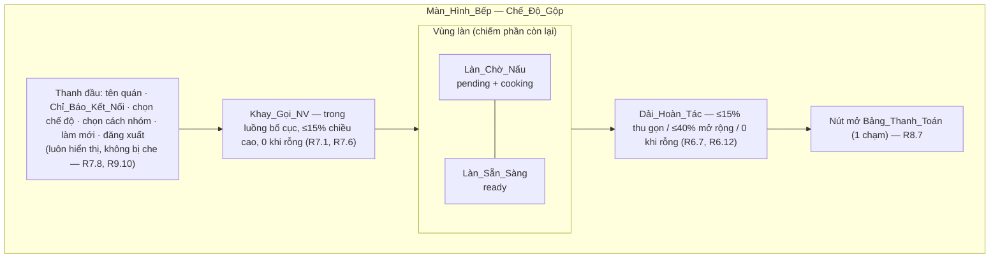
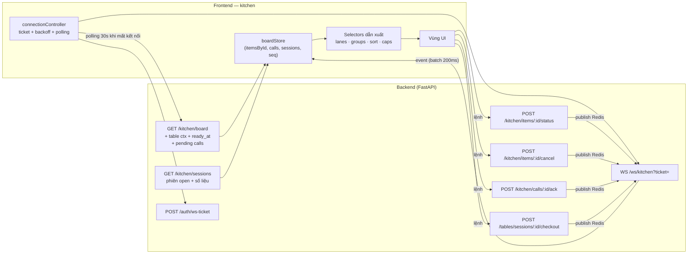
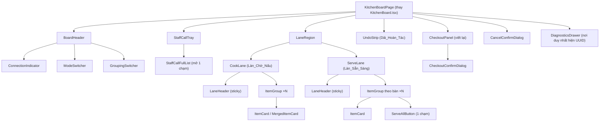
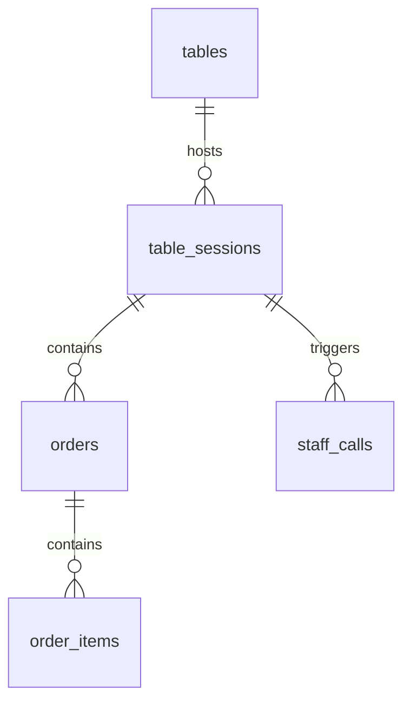
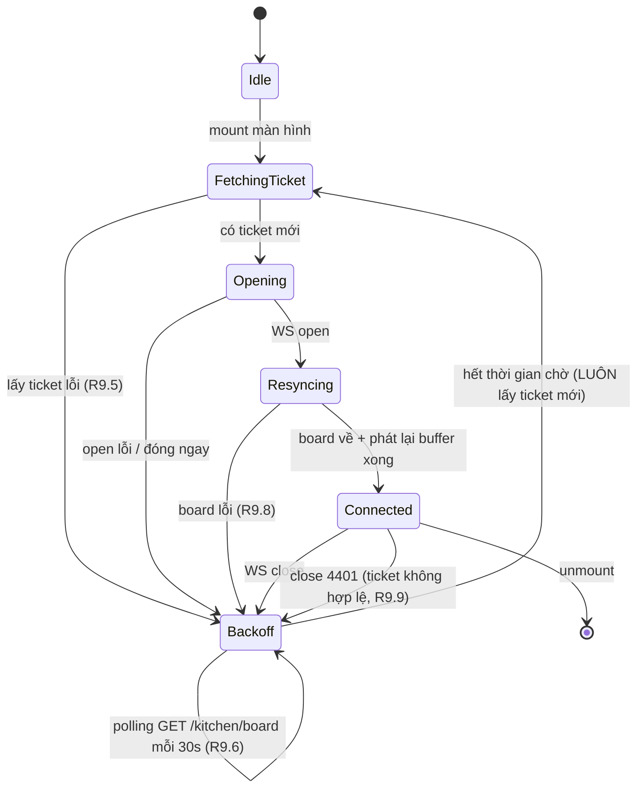

# Design Document — Kitchen Board Redesign

## Overview

Spec này thiết kế lại **kiến trúc thông tin** của màn hình bếp `/kitchen/board`. Trọng tâm là UX: chia màn hình theo hai vai trò (đầu bếp / phục vụ) trên cùng một tablet dùng chung, giảm nhiễu thị giác, và bổ sung **ngữ cảnh bàn** — thứ hiện hoàn toàn không có trên board.

Mọi quy tắc nghiệp vụ của `qorder-mvp` được **giữ nguyên**: máy trạng thái `order_items` (R4.1), cửa sổ hoàn tác 120 giây (R4.7), ánh xạ `overdue_level` (R5.4), cảnh báo món chưa `served` khi checkout (R6.7), tự huỷ món khi đóng bàn (R6.8), cooldown gọi nhân viên (R7.4), quyền huỷ món của nhân viên (R11.4), và cơ chế bật/tắt PIN màn bếp (R12.9/R12.10). Backend chỉ thay đổi ở phần **dữ liệu ngữ cảnh còn thiếu**, không thêm nghiệp vụ mới.

### Nguyên tắc thiết kế

1. **Một tablet, hai vai trò, một khung hình.** Chế_Độ_Gộp là mặc định và phải đủ dùng cho cả hai vai trò; hai chế độ chuyên biệt chỉ là bộ lọc tạm thời.
2. **Nhãn_Bàn là định danh chính trên UI.** UUID chỉ xuất hiện trong khu chẩn đoán lỗi.
3. **Nhấp nháy là tài nguyên khan hiếm.** Chỉ món trễ (`overdue_level ≥ 1`) mới nhấp nháy. Đây là sửa lỗi hiện tại, nơi mọi món đều nhấp nháy.
4. **Server là nguồn sự thật cho danh sách phiên bàn.** Không suy ra danh sách bàn từ event WebSocket đã trôi qua.
5. **`overdue_level` vẫn tính client-side** từ `requested_at` + `prep_time_snapshot` (R5.5 của `qorder-mvp`), không lưu DB.
6. **Mọi thay đổi backend là bổ sung (additive).** Không đổi tên/bỏ field đang có, để client cũ không vỡ.

### Hiện trạng code đã kiểm chứng lại

Đọc trực tiếp `frontend/src/kitchen/*`, `qorder_api/api/kitchen_router.py`, `qorder_api/realtime/__init__.py`, `qorder_api/ws/gateway.py`, `qorder_api/models/*`:

| # | Quan sát | Nguồn |
|---|---|---|
| 1 | `GET /kitchen/board` chỉ trả `order_id`; **không** có `table_session_id`, `table_id`, nhãn bàn | `kitchen_router.py` `get_kitchen_board`, `schemas/kitchen.py` `KitchenBoardItemResponse` |
| 2 | Event `item.updated` / `item.cancelled` trên kênh bếp chỉ mang `{id, status, order_id}` | `kitchen_router.py` `item_payload`, `cancel_payload` |
| 3 | Event `order.created` mang `order.table_session_id` nhưng **không** mang nhãn bàn, và item trong event **thiếu** `menu_item_id`, `prep_time_snapshot`, `requested_at`, `note` | `customer_router.py` `order_payload` |
| 4 | `getBlinkClass` trả `animate-blink-slow` cho `overdue_level = 0` → mọi món đúng hạn cũng nhấp nháy | `KitchenItemCard.tsx` |
| 5 | Keyframes nhấp nháy nằm trong **`frontend/src/index.css`**, không nằm trong `tailwind.config.js`. `tailwind.config.js` có `theme.extend` rỗng kèm comment giải thích lý do tránh theme config | `index.css` cuối file, `tailwind.config.js` |
| 6 | Board không có nút chuyển `cooking`/`ready`; chỉ có "✅ Xong" và "✕" | `KitchenItemCard.tsx` actions |
| 7 | **Backend đã hỗ trợ đủ** `cooking` và `ready`: `ALLOWED_FROM` có `COOKING: {PENDING}` và `READY: {PENDING, COOKING}`; `POST /kitchen/items/{id}/status` nhận `to` là bất kỳ `OrderItemStatus`. Chỉ FE thiếu nút | `services/item_state_service.py`, `schemas/kitchen.py` |
| 8 | Nút huỷ "✕" nằm cạnh "✅ Xong", không xác nhận, không lý do (`reason` gọi với `undefined`) | `KitchenItemCard.tsx`, `KitchenBoard.tsx` `handleCancel` |
| 9 | Thẻ hoàn tác render `name_snapshot="(đã phục vụ)"`, `quantity={0}`, `requested_at=""`, và hiện `ID: xxxxxxxx...`; nằm chung lưới với món đang chờ | `KitchenBoard.tsx` khối `recentlyServed` |
| 10 | `StaffCallNotification` là overlay `fixed top-4 right-4 z-50`, xếp chồng không giới hạn, đè header | `StaffCallNotification.tsx` |
| 11 | `CheckoutPanel` phụ thuộc `orderSessionMapRef`, map này **chỉ** được ghi trong nhánh `order.created` → rỗng sau reload; hiển thị `Phiên: {sessionId.slice(0,8)}...` | `KitchenBoard.tsx`, `CheckoutPanel.tsx` |
| 12 | Board chỉ chứa item `pending`/`cooking`/`ready` → không xem lại được món đã `served` của một bàn | `kitchen_router.py` `active_statuses` |
| 13 | Không có Chỉ_Báo_Kết_Nối. `useKitchenWebSocket` nhận `ticket` một lần từ props và `connect` dùng lại **cùng ticket** cho mọi lần reconnect. Ticket là one-shot (`verify_ws_ticket` GETDEL) → reconnect luôn bị đóng 4401 | `useKitchenWebSocket.ts`, `ws/gateway.py` |
| 14 | **Không có endpoint nào liệt kê staff call đang `pending`.** Chỉ có `POST /kitchen/calls/{id}/ack`. Sau reload, Khay_Gọi_NV rỗng dù DB còn call `pending` | grep toàn bộ `qorder_api/api/*.py` |
| 15 | **Không có endpoint nào liệt kê phiên bàn đang `open`.** Chỉ có open/checkout/restore theo id | `staff_table_router.py` |
| 16 | `order_items` **không có** cột `ready_at` | `models/order.py` |

### Hai sai lệch thuật ngữ cần đính chính

Hai điểm dưới đây lệch giữa `requirements.md` và code thật. Design bám theo **code thật**, và requirements không cần sửa vì đây chỉ là tên cột:

1. **`tables.label` không tồn tại.** Cột thật là `tables.table_number` (`String`, unique theo `(restaurant_id, table_number)`). Trong toàn bộ design này, **Nhãn_Bàn = `tables.table_number`**. Field API mới đặt tên `table_label` để UI không phụ thuộc tên cột DB, giá trị lấy từ `table_number`.
2. **Keyframes nhấp nháy nằm ở `index.css`, không ở `tailwind.config.js`.** Điều này thực ra *củng cố* quyết định thiết kế ở mục 6 bên dưới: hệ thống style khẩn cấp tiếp tục sống trong `index.css`.

## Architecture

### Bố cục vùng của Màn_Hình_Bếp (Chế_Độ_Gộp)



### Luồng dữ liệu



`boardStore` là **một** nguồn sự thật phía client. Mọi vùng UI đọc qua selector dẫn xuất, không giữ state item riêng. Điều này loại bỏ tình trạng hiện tại nơi `items`, `servedMap`, `orderSessionMapRef` và `staffCalls` là bốn nguồn rời rạc trong `KitchenBoard.tsx`.

## Components and Interfaces

### Phần A — Thay đổi backend

#### A1. `GET /kitchen/board` — thêm ngữ cảnh bàn, `ready_at`, và staff call

`KitchenBoardItemResponse` được **bổ sung** (mọi field cũ giữ nguyên):

| Field mới | Kiểu | Nguồn | Requirement |
|---|---|---|---|
| `table_session_id` | `UUID` | `orders.table_session_id` | R2.1 |
| `table_id` | `UUID` | `table_sessions.table_id` | R2.1 |
| `table_label` | `str \| None` | `tables.table_number` | R2.1, R2.5 |
| `ready_at` | `datetime \| None` | cột mới `order_items.ready_at` | R5.6, R5.7 |

`KitchenBoardResponse` được bổ sung `pending_calls: list[KitchenStaffCallResponse]` để Khay_Gọi_NV có dữ liệu ngay sau reload (khắc phục quan sát 14, phục vụ R7.2/R7.4):

```python
class KitchenStaffCallResponse(BaseModel):
    id: UUID
    table_id: UUID
    table_session_id: UUID
    table_label: str | None
    created_at: datetime

class KitchenBoardResponse(BaseModel):
    items: list[KitchenBoardItemResponse]
    pending_calls: list[KitchenStaffCallResponse]
    server_time: datetime   # mốc để client hiệu chỉnh lệch giờ khi tính phút chờ
```

**Đường join và cách tránh N+1.** Một câu `select` duy nhất, không lazy-load:

```python
stmt = (
    select(
        OrderItem,
        Order.table_session_id,
        TableSession.table_id,
        Table.table_number,
    )
    .join(Order, OrderItem.order_id == Order.id)
    .join(TableSession, Order.table_session_id == TableSession.id)
    .join(Table, TableSession.table_id == Table.id)
    .where(
        OrderItem.restaurant_id == user.restaurant_id,
        OrderItem.status.in_(ACTIVE_STATUSES),
    )
    .order_by(OrderItem.requested_at.asc())
)
```

Ba `JOIN` là inner join trên khoá ngoại `NOT NULL`, nên không mất item. Router hiện dùng `select(OrderItem)` rồi vòng lặp Python — chỉ cần đổi thành tuple-select ở trên và đọc thêm ba cột từ row; **không** thêm truy vấn trong vòng lặp. `pending_calls` là **một** câu select riêng (join `staff_calls → tables`), tổng cộng 2 round-trip cho cả endpoint.

Index đã có `ix_order_items_restaurant_status (restaurant_id, status)` phục vụ đúng `WHERE` này. Không cần index mới.

`server_time` cho phép client bù lệch đồng hồ thiết bị. Tablet bếp có thể lệch giờ vài phút, và toàn bộ Requirement 4 (số phút chờ, `overdue_level`) tính client-side từ `requested_at`. Client lưu `clockSkew = Date.now() - server_time` tại mỗi lần đồng bộ và dùng `now() - clockSkew` khi tính. Đây là bổ sung nhỏ nhưng chặn được cả một lớp lỗi "board hiển thị mọi món trễ mức 3".

#### A2. Endpoint mới `GET /kitchen/sessions` — danh sách phiên bàn đang `open`

```python
class KitchenSessionSummary(BaseModel):
    session_id: UUID
    table_id: UUID
    table_label: str | None
    opened_at: datetime
    served_count: int          # số item status='served'
    unserved_count: int        # số item status ∈ {pending, cooking, ready}
    provisional_total: Decimal # Σ(price_snapshot × quantity) trên item 'served'

class KitchenSessionsResponse(BaseModel):
    sessions: list[KitchenSessionSummary]
```

**Quyết định: thêm endpoint mới thay vì mở rộng `GET /kitchen/board`.** Lý do:

- Hai tập dữ liệu có **điều kiện lọc khác nhau**: board lọc theo item đang hoạt động, còn Requirement 8.2 yêu cầu liệt kê phiên `open` **kể cả khi không còn item chưa `served`**. Nhồi vào board sẽ buộc endpoint trả hai tập rời nhau với ngữ nghĩa khác nhau.
- `provisional_total` cần quét cả item `served` — tập dữ liệu lớn hơn board nhiều. Ghép vào board làm chậm đường nóng (board được đồng bộ lại mỗi 30 giây khi mất kết nối, còn danh sách phiên thì không cần).
- Requirement 9.6 chỉ yêu cầu polling `GET /kitchen/board`, không yêu cầu polling danh sách phiên. Tách ra cho phép hai nhịp làm mới khác nhau.

`pending_calls` thì **ngược lại**, được gộp vào board vì cùng nhịp cập nhật (realtime, hiển thị thường trực ở Chế_Độ_Gộp) và khối lượng nhỏ.

Truy vấn: một `select` trên `table_sessions` join `tables`, kèm hai subquery tổng hợp trên `order_items` (join qua `orders`) — `FILTER (WHERE status = 'served')` cho `served_count` và `provisional_total`, `FILTER (WHERE status IN (...))` cho `unserved_count`. Một round-trip, `LEFT JOIN` nên phiên không có item vẫn xuất hiện với các số bằng 0 (đúng R8.2).

Endpoint đặt dưới prefix `/kitchen` (đã có guard `require_role("staff","admin")`) chứ không dưới `/tables`, vì đây là dữ liệu đọc phục vụ màn bếp.

#### A3. Endpoint mới `GET /kitchen/sessions/{session_id}/items`

Requirement 8.5 cần liệt kê **mọi** món chưa `served` của một phiên trong bước xác nhận thanh toán, kể cả món không nằm trong 120 thẻ đang render. Requirement 2 của phần "Hiện trạng" (quan sát 12) cũng cho thấy không có đường nào xem lại món của một bàn.

Trả về danh sách item của phiên kèm `status`, `name_snapshot`, `quantity`, `price_snapshot`, `note`. Bảng_Thanh_Toán gọi endpoint này khi nhân viên chọn một bàn, thay vì suy ra từ board (board có thể đã bị cắt ở mốc 120 thẻ).

#### A4. Payload realtime — thêm ngữ cảnh bàn (R2.2)

| Event | Nơi publish | Bổ sung |
|---|---|---|
| `item.updated` | `kitchen_router.set_item_status` | `item.table_session_id`, `item.table_id`, `item.table_label`, `item.ready_at`, `item.served_at` |
| `item.cancelled` | `kitchen_router.cancel_item_staff` **và** `customer_router.cancel_item_customer` | `item.table_session_id`, `item.table_id`, `item.table_label` |
| `order.created` | `customer_router.create_order` | `order.table_id`, `order.table_label`; và mỗi item bổ sung `menu_item_id`, `price_snapshot`, `prep_time_snapshot`, `note`, `requested_at`, `table_session_id`, `table_label` |

Bổ sung `order.created` là **bắt buộc**, không phải tuỳ chọn: item trong event hiện thiếu `prep_time_snapshot` và `requested_at`, nên món mới đến qua WS không tính được `overdue_level` và số phút chờ. Đây là lý do board hiện tại phải dựa vào `loadBoard()` để dữ liệu đúng.

Hai router huỷ món đã tự truy vấn `Order.table_session_id`; chỉ cần mở rộng câu select đó thành join tới `tables` để lấy thêm `table_id` + `table_number`. Không thêm round-trip.

`customer_router.create_order` đã có sẵn cả `table` và `table_session` trong scope → không cần truy vấn thêm.

Sự kiện `staff_call.new` trong `StaffCallService.create` cũng bổ sung `call.table_label` (service đã có `table_id`, cần thêm một select nhỏ hoặc truyền `table_number` từ router — chọn truyền tham số từ router vì `customer_router.call_staff` đã có object `table` trong scope, tránh round-trip).

**Ràng buộc tương thích:** mọi field trên đều là **thêm mới**. Client cũ bỏ qua field lạ. `table_label` khai báo `str | None` vì `qr_token` có thể được sinh lại nhưng bàn vẫn tồn tại; giá trị `None` chỉ xảy ra nếu dữ liệu bất thường, và UI xử lý bằng nhãn dự phòng "Bàn ?" (R2.5).

#### A5. Chuyển trạng thái `cooking` / `ready` — không cần endpoint mới

Đã kiểm chứng: `ALLOWED_FROM` trong `item_state_service.py` có `COOKING: {PENDING}` và `READY: {PENDING, COOKING}`; `SetItemStatusRequest.to` nhận cả `OrderItemStatus`. Vậy `POST /kitchen/items/{id}/status` với `{"to": "cooking"}` hoặc `{"to": "ready"}` **đã hoạt động**. Requirement 5.1 chỉ là thiếu ở FE.

Thay đổi backend duy nhất cần cho `ready`: nhánh "forward transition" của `set_status` phải ghi `ready_at`:

```python
# khi to_status == READY
UPDATE order_items
SET status = 'ready', ready_at = now()
WHERE id = :item_id AND restaurant_id = :restaurant_id
  AND status = ANY(:allowed_from)
RETURNING *
```

Và khi hoàn tác `served → pending` (R4.7), ngoài `served_by`/`served_at` phải đặt `ready_at = NULL` — món quay về đầu luồng thì "thời điểm sẵn sàng" cũ không còn ý nghĩa. Nếu không xoá, món hoàn tác sẽ hiện chỉ báo "chờ mang ra quá lâu" (R5.7) một cách sai lệch.

Ngữ nghĩa `ready_at` được chốt như sau, để không sinh trạng thái mờ:

- Đặt `now()` khi và chỉ khi transition đích là `ready`.
- Xoá về `NULL` khi hoàn tác `served → pending`.
- Giữ nguyên khi `ready → served` (không cần, nhưng để lại làm dấu vết).
- Không đặt khi `pending → served` trực tiếp (món chưa bao giờ ở `ready`).

`_row_to_order_item` bổ sung `ready_at=row["ready_at"]`.

#### A6. Migration `0004` — cột `ready_at`

```python
"""add ready_at to order_items

Revision ID: 0004_add_order_item_ready_at
Revises: 0003_menu_image_featured
"""
revision = "0004_add_order_item_ready_at"
down_revision = "0003_menu_image_featured"

def upgrade() -> None:
    op.add_column(
        "order_items",
        sa.Column("ready_at", sa.DateTime(timezone=True), nullable=True),
    )

def downgrade() -> None:
    op.drop_column("order_items", "ready_at")
```

Nullable, không backfill: item lịch sử không có mốc `ready` thật, và bịa ra một giá trị sẽ làm sai chỉ báo R5.7. Không cần index — `ready_at` chỉ được đọc trên tập item đang hoạt động đã lọc bằng index sẵn có.

`models/order.py` bổ sung:

```python
ready_at: Mapped[datetime | None] = ts_column(nullable=True)
```

### Phần B — Kiến trúc component frontend

#### Cây component mới



#### Trạng thái file

| File | Trạng thái | Ghi chú |
|---|---|---|
| `kitchen/KitchenBoard.tsx` | **Viết lại** | Còn là điểm vào route, nhưng chỉ lắp ghép các vùng; toàn bộ logic chuyển sang store/controller |
| `kitchen/KitchenItemCard.tsx` | **Viết lại** | Thêm Nhãn_Bàn, số phút, kênh khẩn cấp thứ hai, nút `cooking`/`ready`, huỷ chuyển vào menu phụ; bỏ `getBlinkClass` trả nhấp nháy ở mức 0 |
| `kitchen/CheckoutPanel.tsx` | **Viết lại** | Nạp từ `GET /kitchen/sessions`, bỏ `orderSessionMap`, hiện Nhãn_Bàn |
| `kitchen/StaffCallNotification.tsx` | **Xoá** | Thay bằng `StaffCallTray.tsx` (trong luồng bố cục, không overlay) |
| `kitchen/useKitchenWebSocket.ts` | **Viết lại** | Tự lấy ticket mỗi lần kết nối; phát trạng thái kết nối; buffer event khi đang resync |
| `kitchen/types.ts` | **Sửa** | Thêm field bàn + `ready_at`; thêm type cho session summary, staff call, chế độ, cách nhóm |
| `kitchen/api.ts` | **Sửa** | Thêm `fetchKitchenSessions`, `fetchSessionItems`; `cancelItemKitchen` truyền `reason` bắt buộc |
| `kitchen/KitchenLayout.tsx` | **Giữ nguyên** | Chỉ là wrapper `KitchenAuthProvider` |
| `kitchen/AuthContext.tsx` | **Giữ nguyên** | |
| `kitchen/boardStore.ts` | **Mới** | Store trung tâm |
| `kitchen/selectors.ts` | **Mới** | Chia làn, nhóm, sắp xếp, cắt ở 120 |
| `kitchen/urgency.ts` | **Mới** | `computeOverdueLevel`, phút chờ/còn lại, ánh xạ mức → kênh thị giác |
| `kitchen/connectionController.ts` | **Mới** | Máy trạng thái kết nối, backoff, polling |
| `kitchen/preferences.ts` | **Mới** | Đọc/ghi localStorage cho chế độ + cách nhóm |
| `kitchen/BoardHeader.tsx`, `ModeSwitcher.tsx`, `GroupingSwitcher.tsx`, `ConnectionIndicator.tsx` | **Mới** | |
| `kitchen/CookLane.tsx`, `ServeLane.tsx`, `LaneHeader.tsx`, `ItemGroup.tsx`, `MergedItemCard.tsx` | **Mới** | |
| `kitchen/UndoStrip.tsx` | **Mới** | Thay khối `recentlyServed` lỗi trong lưới |
| `kitchen/StaffCallTray.tsx` | **Mới** | |
| `kitchen/CancelConfirmDialog.tsx`, `CheckoutConfirmDialog.tsx` | **Mới** | |
| `kitchen/DiagnosticsDrawer.tsx` | **Mới** | Nơi duy nhất hiển thị UUID (R2.6) |
| `frontend/src/index.css` | **Sửa** | Thêm biến + class hệ thống khẩn cấp `kb-*`, biến thể `prefers-reduced-motion` |
| `frontend/tailwind.config.js` | **Giữ nguyên** | Xem quyết định D5 |

## Data Models

### Thay đổi schema DB

Chỉ một thay đổi: `order_items.ready_at TIMESTAMPTZ NULL` (migration `0004`). Không bảng mới, không đổi enum, không đổi index.



Đường đi của Nhãn_Bàn tới một item: `order_items.order_id → orders.table_session_id → table_sessions.table_id → tables.table_number`. Ba bước join, tất cả trên khoá ngoại `NOT NULL`.

### Model dữ liệu phía client

```ts
type ItemStatus = "pending" | "cooking" | "ready" | "served" | "cancelled";

interface BoardItem {
  id: string;
  order_id: string;
  menu_item_id: string;
  table_session_id: string;
  table_id: string;
  table_label: string | null;     // null → UI hiện "Bàn ?" (R2.5)
  name_snapshot: string;
  price_snapshot: string;
  prep_time_snapshot: number;      // 0 → Món_Phục_Vụ_Ngay
  quantity: number;
  note: string | null;
  status: ItemStatus;
  requested_at: string;
  ready_at: string | null;
  served_at: string | null;
}

interface PendingCall {
  id: string;
  table_id: string;
  table_session_id: string;
  table_label: string | null;
  created_at: string;
}

interface SessionSummary {
  session_id: string;
  table_id: string;
  table_label: string | null;
  opened_at: string;
  served_count: number;
  unserved_count: number;
  provisional_total: string;
}

type DisplayMode = "merged" | "cook" | "serve";     // Gộp | Nấu | Phục_Vụ
type GroupingMode = "table" | "dish";               // Nhóm_Bàn | tên món
type ConnectionState = "connecting" | "connected" | "disconnected";

interface BoardState {
  itemsById: Map<string, BoardItem>;   // chứa cả item 'served' còn trong cửa sổ 120s
  pendingCalls: Map<string, PendingCall>;
  sessions: Map<string, SessionSummary>;
  lastSeq: number;                     // seq event lớn nhất đã áp
  lastSyncAt: number | null;           // mốc đồng bộ thành công gần nhất (R9.2)
  clockSkewMs: number;                 // Date.now() - server_time
  connection: ConnectionState;
  displayMode: DisplayMode;            // bền theo thiết bị
  groupingMode: GroupingMode;          // bền theo thiết bị
  sessionsLoadState: "idle" | "loading" | "ok" | "error";  // R8.8 vs R8.9
}
```

Điểm then chốt: `itemsById` **giữ lại** item vừa `served` (khác board hiện tại, nơi item `served` bị `filter` khỏi state ngay). Dải_Hoàn_Tác cần tên món thật, số lượng thật và Nhãn_Bàn (R6.4) — đây chính là lý do thẻ hoàn tác hiện tại phải bịa `name_snapshot="(đã phục vụ)"` và `quantity={0}`. Item `served` bị **xoá khỏi store** khi `now - served_at ≥ 120s` (R6.5), do một tick 1 giây quét qua. Item `cancelled` bị xoá ngay (R6.6: món `cancelled` không vào Dải_Hoàn_Tác).

`sessionsLoadState` là bắt buộc để phân biệt "lỗi nạp" (R8.8) với "không có bàn nào mở" (R8.9) — board hiện tại luôn hiện thông báo rỗng cho cả hai.

### Persistence trên thiết bị

`localStorage` key `qorder.kitchen.prefs.v1`:

```json
{ "displayMode": "merged", "groupingMode": "table", "laneFocus": "cook" }
```

Đọc một lần khi mount, ghi mỗi khi đổi (R1.8, R3.3). Giá trị không parse được hoặc không thuộc enum → dùng mặc định `merged` + `table` (R1.2, R3.2). `laneFocus` chỉ dùng ở viewport < 768 px (R10.6). Không lưu bất kỳ dữ liệu nghiệp vụ nào vào localStorage — chỉ preference hiển thị.

## State Management

### Nguồn ghi vào store

| Nguồn | Ghi gì |
|---|---|
| `GET /kitchen/board` | Thay **toàn bộ** `itemsById` (mục item hoạt động) + `pendingCalls`; đặt `lastSyncAt`, `clockSkewMs` |
| `GET /kitchen/sessions` | Thay toàn bộ `sessions`; đặt `sessionsLoadState` |
| Event WS | Cập nhật từng mục theo `id`; đặt `lastSyncAt` |
| Thao tác cục bộ | Cập nhật lạc quan (optimistic) + ghi nhận trạng thái trước để hoàn nguyên (R6.9) |
| Tick 1 giây | Xoá item `served` hết cửa sổ 120s |
| Tick 15 giây | Kích hoạt render lại để cập nhật phút chờ / `overdue_level` (R4.6, R7.2) |

Quan trọng: khi resync thay `itemsById`, các item `served` đang trong cửa sổ hoàn tác **được giữ lại** (board không trả item `served`). Nếu không giữ, mỗi lần resync sẽ xoá sạch Dải_Hoàn_Tác và nhân viên mất khả năng hoàn tác — mà resync xảy ra mỗi 30 giây khi mạng kém.

### Thuật toán resync-rồi-phát-lại (R9.3)

```
onConnectionOpen():
  bufferMode = true
  buffer = []                       # event nhận trong lúc chờ phản hồi
  resp = await GET /kitchen/board    # timeout 10s
  if resp thất bại:
     bufferMode = false; buffer = []      # R9.8: giữ nguyên tập item, báo chưa đồng bộ
     connection = "disconnected"
     schedule retry theo backoff
     return
  # thay thế toàn bộ TRƯỚC khi áp bất kỳ event nào
  served_giữ_lại = [i in itemsById nếu i.status == "served"
                                  và now - i.served_at < 120s]
  itemsById     = index(resp.items) ∪ index(served_giữ_lại)
  pendingCalls  = index(resp.pending_calls)
  clockSkewMs   = Date.now() - parse(resp.server_time)
  lastSyncAt    = Date.now()
  lastSeq       = 0
  # phát lại buffer theo đúng thứ tự nhận
  for ev in buffer (theo thứ tự nhận):
      applyEvent(ev)
  bufferMode = false
  connection = "connected"

onWsMessage(ev):
  if bufferMode: buffer.push(ev); return
  applyEvent(ev)

applyEvent(ev):
  if ev.seq <= lastSeq: return          # chống áp event cũ
  lastSeq = max(lastSeq, ev.seq)
  lastSyncAt = Date.now()
  switch ev.type:
    "order.created":    upsert từng item trong ev.order.items (gắn ngữ cảnh bàn)
    "item.updated":     upsert ev.item; nếu status == "served" → giữ trong store
                        cho Dải_Hoàn_Tác; nếu "cancelled" → xoá
    "item.cancelled":   xoá ev.item.id
    "staff_call.new":   upsert pendingCalls
    "staff_call.ack":   xoá khỏi pendingCalls
    "session.closed" | "session.abandoned":
                        xoá mọi item có table_session_id trùng;
                        xoá phiên khỏi sessions; xoá call của phiên;
                        refetch GET /kitchen/sessions
    "session.restored": refetch GET /kitchen/sessions
```

Hai điểm bảo đảm tính hội tụ:

1. **`buffer` không bị bỏ.** Event đến trong lúc chờ HTTP được giữ và phát lại đúng thứ tự (R9.3 nói rõ điều này). Board hiện tại gọi `onReconnect → loadBoard()` rồi để event chạy song song, nên một event đến giữa lúc chờ có thể bị snapshot cũ hơn ghi đè.
2. **`lastSeq` reset về 0 sau khi thay tập item.** Snapshot HTTP không có `seq`, nên không thể so sánh với `seq` cũ. Vì buffer chứa mọi event kể từ lúc mở kết nối, và mọi event đó đều mới hơn hoặc bằng snapshot, phát lại tất cả là an toàn: `applyEvent` là **idempotent** trên từng `id` (upsert theo trạng thái đích, không phải delta cộng dồn).

Chính vì `applyEvent` idempotent theo `id` và mọi event mang **trạng thái đích tuyệt đối** (không phải "tăng/giảm"), kết quả cuối cùng chỉ phụ thuộc event cuối cùng cho mỗi `id` — đây là cơ sở của Property 4.

### Gộp event 200 ms (R10.3) và mốc 120 thẻ (R10.10)

```
pendingEvents = []
flushTimer = null

onWsMessage(ev):
  applyToShadowState(ev)              # cập nhật dữ liệu ngay, KHÔNG render
  if flushTimer == null:
     flushTimer = setTimeout(flush, 200)

flush():
  flushTimer = null
  commitShadowToStore()               # một lần render duy nhất
```

Store nội bộ mutate ngay để không mất dữ liệu; chỉ **thông báo cho React** ở mốc 200 ms. Với `useSyncExternalStore`, điều này gom N event trong cửa sổ thành 1 lần render. Cửa sổ là **trailing window đơn giản**: event đầu mở cửa sổ, mọi event trong 200 ms tiếp theo cùng chung một flush. R10.3 yêu cầu "hoàn tất render lại trong vòng 200 ms kể từ event cuối của cửa sổ" — mốc flush cách event cuối tối đa 200 ms, và render một danh sách ≤120 thẻ nằm trong ngân sách này.

Mốc 120 thẻ được áp ở **tầng selector**, sau khi nhóm và sắp xếp, **theo từng làn**:

```
capLane(groups, cap = 120):
  out = []; used = 0
  for g in groups (đã sắp xếp):
      for card in g.cards (đã sắp xếp):
          if used == cap: return { groups: out, hiddenCount: đếm phần còn lại }
          push card vào out; used += 1
  return { groups: out, hiddenCount: 0 }
```

Cắt sau khi sắp xếp là bắt buộc: R10.10 nói "120 Thẻ_Món đầu **theo thứ tự sắp xếp hiện hành**". Vì sắp xếp đặt `overdue_level` cao lên trước, món bị ẩn luôn là món ít khẩn cấp nhất. `hiddenCount` hiển thị dưới dạng con số tổng của làn.

### Cập nhật lạc quan và hoàn nguyên (R6.8, R6.9)

```
performAction(itemId, action):
  before = snapshot(itemsById[itemId])
  applyOptimistic(itemId, action)
  try:
     resp = await POST ... (timeout 10s)
     applyServerResult(resp)
  catch HTTP 409:
     hiển thị "món đã được người khác cập nhật"
     await GET /kitchen/board (trong 2s)   # R6.8
     thay tập item bằng kết quả
  catch network | timeout:
     restore(before)                       # R6.9, trong 1s
     hiển thị lỗi + nút "Thử lại"
     KHÔNG tự gửi lại
```

Không tự động retry là có chủ ý: `POST /kitchen/items/{id}/status` không idempotent theo nghĩa nghiệp vụ (một lần `served` thành công rồi retry sẽ nhận 409 và làm nhiễu). R6.9 nói rõ "SHALL không tự động gửi lại".

## WebSocket Reconnect Design

### Máy trạng thái kết nối



Ánh xạ sang Chỉ_Báo_Kết_Nối (R9.1):

| Trạng thái máy | Chỉ_Báo_Kết_Nối |
|---|---|
| `FetchingTicket`, `Opening`, `Resyncing` | "đang kết nối" |
| `Connected` | "đã kết nối" |
| `Idle`, `Backoff` | "mất kết nối" |

`Resyncing` được xếp vào "đang kết nối" vì R9.1 định nghĩa "đã kết nối" là *kết nối đang mở **và** lần đồng bộ thành công gần nhất đã hoàn tất*.

### Ticket mới cho mỗi lần mở kết nối (R9.4, R9.9)

Đây là sửa lỗi cốt lõi. Ticket là one-shot: `verify_ws_ticket` dùng `GETDEL` trên Redis với TTL 30 giây. Hiện `useKitchenWebSocket` nhận `ticket` như một prop tính một lần trong `KitchenBoard.useEffect` và `connect()` dùng lại chuỗi đó mãi → lần reconnect đầu tiên đã bị đóng 4401, rồi vòng lặp backoff quay vòng vô nghĩa.

Thiết kế mới: `connectionController` **sở hữu** vòng đời ticket.

```
connectOnce():
  state = FetchingTicket
  ticket = await POST /auth/ws-ticket    # LUÔN gọi mới, không cache
  state = Opening
  ws = new WebSocket(`${wsBase}/ws/kitchen?ticket=${encodeURIComponent(ticket)}`)
  ticket = null                          # dùng xong bỏ ngay, không giữ lại
```

Ticket không bao giờ được lưu vào state React, không bao giờ vào localStorage, và bị gán `null` ngay sau khi đưa vào URL. Nhờ vậy không có đường nào dùng lại (cơ sở của Property 7). Riêng với close code 4401, controller vẫn đi qua đúng nhánh `Backoff → FetchingTicket` như mọi lần đóng khác — không có đường tắt nào bỏ qua bước lấy ticket mới.

Khi `kitchen_screen_requires_pin = FALSE`, `POST /auth/ws-ticket` được gọi **không có** header `Authorization` (R9.7). `api.getWsTicket` hiện đã hỗ trợ `token = null`, giữ nguyên hành vi đó.

### Backoff (R9.5)

```
attempt = 0
delay(attempt) = min(1000 * 2^attempt, 30000)   # 1s, 2s, 4s, 8s, 16s, 30s, 30s, ...
```

Đặt lại `attempt = 0` khi và chỉ khi vào `Connected` (tức resync đã xong), không phải khi WS open. Nếu reset ở lúc open, một vòng lặp "open rồi board lỗi" sẽ thành retry 1 giây liên tục và đập vào backend.

Thử lại **không giới hạn số lần** trong khi màn hình còn mở, và **giữ nguyên tập item đang hiển thị** ở mọi lần thất bại.

### Polling dự phòng (R9.6)

Khi ở `Backoff` quá 30 giây liên tục, một timer độc lập gọi `GET /kitchen/board` mỗi 30 giây với `AbortController` timeout 10 giây. Thành công → cập nhật tập item và đặt lại `lastSyncAt`. Thất bại → giữ nguyên tập item, giữ Chỉ_Báo_Kết_Nối ở "mất kết nối", hiển thị thông báo dữ liệu chưa đồng bộ (R9.8).

Polling **độc lập** với vòng backoff của WS: hai timer riêng. Lý do: backoff có thể đã giãn tới 30 giây/lần, nhưng nhân viên vẫn cần dữ liệu tươi; và ngược lại, một lần polling thành công không đồng nghĩa WS đã mở lại.

Chỉ_Báo_Kết_Nối vẫn hiện "mất kết nối" khi chỉ có polling hoạt động — đúng theo định nghĩa R9.1 ("mất kết nối khi không có kết nối realtime đang mở"), và đúng về mặt vận hành: dữ liệu trễ tới 30 giây thì nhân viên cần biết.

## Urgency Visual System

### Ánh xạ mức → biểu đạt

| `overdue_level` | Nhấp nháy | Nhãn chữ (kênh 2) | Thanh tiến độ | Viền |
|---|---|---|---|---|
| `null` (`prep_time_snapshot = 0`) | không | "Phục vụ ngay" | ẩn | trung tính |
| `0` | **không** (tĩnh) | "Đúng hạn · còn N phút" | 0–100 % | trung tính |
| `1` | 1 s/chu kỳ | "Trễ · N phút" | đầy + vạch tràn | cảnh báo |
| `2` | 0,6 s/chu kỳ | "Trễ nhiều · N phút" | đầy + vạch tràn | cảnh báo đậm |
| `3` | 0,3 s/chu kỳ | "Trễ nặng · N phút" 🧨 | đầy + vạch tràn | nguy cấp |

Mức 0 tĩnh là **sửa lỗi** so với `getBlinkClass` hiện tại (trả `animate-blink-slow` cho mức 0). Đây chính là nguyên nhân "board đông thì cả màn hình nhấp nháy" ghi trong requirements.

**Hai kênh đồng thời, một kênh không màu không nhấp nháy (R4.7):** nhãn chữ + thanh tiến độ. Nhãn chữ đứng độc lập với màu và với chuyển động, nên nhân viên khó phân biệt màu hoặc nhìn nhanh đều đọc được bậc khẩn cấp. Emoji 🧨 là kênh thứ ba ở mức 3, không phải kênh chính.

**`prefers-reduced-motion` (R4.10):** thay nhấp nháy bằng viền dày dần + nền đậm dần theo bậc, giữ nguyên nhãn chữ và thanh tiến độ. Bậc 0..3 vẫn phân biệt được đầy đủ, chỉ mất chuyển động.

**Tương phản ở mọi pha nhấp nháy (R10.2):** keyframe hiện tại là `opacity: 1 → 0.4` trên **cả thẻ**, nghĩa là ở pha 0.4 chữ 16 px tụt xa dưới 4,5:1. Thiết kế mới **không animate `opacity` của thẻ**. Thay vào đó animate `background-color` và `box-shadow` của một **lớp chỉ báo riêng** (viền/dải bên trái thẻ), giữ chữ và nền chữ hoàn toàn tĩnh:

```css
@keyframes kb-pulse-ring {
  0%, 100% { box-shadow: 0 0 0 3px var(--kb-ring-a); }
  50%      { box-shadow: 0 0 0 3px var(--kb-ring-b); }
}
```

`--kb-ring-a` và `--kb-ring-b` đều được chọn đạt ≥3:1 so với nền liền kề, nên bất biến tương phản giữ ở mọi pha. Đây là điều kiện chỉ có thể thoả nếu animate riêng lớp chỉ báo — animate `opacity` toàn thẻ về mặt toán học không thể giữ 4,5:1.

### Nơi đặt style

Toàn bộ hệ thống khẩn cấp đặt trong **`frontend/src/index.css`** dưới dạng CSS custom properties + class `kb-*`, cùng chỗ với các keyframes nhấp nháy hiện có và cùng cách làm với theme khách `qo-*`.

Lý do (đã có tiền lệ trong repo): comment trong `index.css` và trong `tailwind.config.js` đều ghi rõ rằng sửa `theme` trong `tailwind.config.js` chỉ có hiệu lực sau khi restart hẳn dev server, vì PostCSS cache config theo process — nếu không restart thì cả palette bị âm thầm rơi. Một hệ thống màu an toàn (mức khẩn cấp, ngưỡng tương phản) không được phép phụ thuộc vào việc developer có restart đúng lúc. `tailwind.config.js` giữ `theme.extend` rỗng như hiện tại.

```css
:root {
  --kb-ring-0: <trung tính>;  --kb-ring-1: <cảnh báo>;
  --kb-ring-2: <cảnh báo đậm>; --kb-ring-3: <nguy cấp>;
  --kb-ring-a: ...; --kb-ring-b: ...;
}
.kb-urgency-0 { /* tĩnh */ }
.kb-urgency-1 { animation: kb-pulse-ring 1s ease-in-out infinite; }
.kb-urgency-2 { animation: kb-pulse-ring 0.6s ease-in-out infinite; }
.kb-urgency-3 { animation: kb-pulse-ring 0.3s ease-in-out infinite; }

@media (prefers-reduced-motion: reduce) {
  .kb-urgency-1, .kb-urgency-2, .kb-urgency-3 { animation: none; }
  .kb-urgency-1 { box-shadow: 0 0 0 3px var(--kb-ring-1); }
  .kb-urgency-2 { box-shadow: 0 0 0 5px var(--kb-ring-2); }
  .kb-urgency-3 { box-shadow: 0 0 0 7px var(--kb-ring-3); }
}
```

Bốn class `animate-blink-*` cũ được giữ lại tạm thời (`StaffCallNotification` bị xoá là nơi duy nhất còn dùng ngoài `KitchenItemCard`), và xoá trong task cuối của quá trình triển khai.

### Phạm vi (R4.9)

Hệ thống khẩn cấp chỉ áp dụng cho `frontend/src/kitchen/*`. Màn khách (`qo-*` classes) không thay đổi, giữ nguyên R5.7 của `qorder-mvp`.

## Grouping and Sorting Algorithms

### Chia làn (Requirement 1.3, 5.2, 6.6)

```
laneOf(item):
  if item.status ∈ {pending, cooking}: return COOK      # Làn_Chờ_Nấu
  if item.status == ready:             return SERVE      # Làn_Sẵn_Sàng
  if item.status == served:            return UNDO        # Dải_Hoàn_Tác
  # cancelled không bao giờ có trong store
```

Hàm này **toàn phần và rời nhau** trên bốn trạng thái có thể tồn tại trong store — cơ sở của Property 1. Item `served` không bao giờ vào COOK/SERVE, và item `cancelled` không bao giờ vào UNDO (R6.6).

### Nhóm theo Nhóm_Bàn (mặc định — R3.2, R3.5)

```
groupByTable(items):
  buckets = {}                       # khoá: table_session_id
  for it in items:
      key = it.table_session_id
      buckets[key].items.push(it)
  for b in buckets:
      b.label       = nhãn bàn của item đầu, hoặc "Bàn ?" nếu null   # R2.5
      b.minRequested = min(it.requested_at for it in b.items)
      b.items       = sortWithinGroup(b.items)
  return sort(buckets, by = (minRequested asc, label asc, key asc))
```

Sắp xếp nhóm theo `requested_at` nhỏ nhất trong nhóm, tăng dần (R3.5). Hai khoá phụ `label` rồi `key` để thứ tự **tuyệt đối xác định** khi trùng mốc thời gian — không có khoá phụ thì hai lần render có thể cho hai thứ tự khác nhau, và board sẽ "nhảy" dưới tay nhân viên.

### Nhóm theo tên món (R3.4)

Gộp khi **cùng `menu_item_id` VÀ cùng `note`**. `note` phải tham gia khoá: gộp "Bún bò" với "Bún bò — không hành" thành một thẻ sẽ khiến bếp nấu sai.

```
groupByDish(items):
  buckets = {}                       # khoá: (menu_item_id, normalizeNote(note))
  for it in items:
      buckets[key(it)].members.push(it)
  cards = []
  for b in buckets:
      cards.push({
        kind: "merged",
        menu_item_id, note,
        name: b.members[0].name_snapshot,
        totalQuantity: Σ member.quantity,                    # R3.4
        tableLabels: distinct(labelOf(m) for m in b.members), # R3.4
        maxOverdueLevel: max(levelOf(m)),
        minRequested: min(m.requested_at),
        members: b.members,                                  # để mở nhóm — R3.8
      })
  return sort(cards, by = (maxOverdueLevel desc, minRequested asc, name asc, key asc))

normalizeNote(n) = (n == null || trim(n) == "") ? "" : trim(n)
```

`normalizeNote` chuẩn hoá `null` và chuỗi trắng thành cùng một khoá — hai món "không ghi chú" nên gộp được, dù một cái là `null` và cái kia là `""`.

Thẻ gộp dùng `maxOverdueLevel` để không bao giờ "che" một món trễ nặng phía sau một nhóm nhìn có vẻ đúng hạn.

### Mở thẻ gộp (R3.8)

`MergedItemCard` có nút mở nhóm; khi mở, render `members` thành `ItemCard` riêng, mỗi thẻ mang Nhãn_Bàn của chính nó và thao tác trên đúng một `item_id`. Trạng thái mở/đóng là state cục bộ của thẻ, khoá theo `(menu_item_id, note)` để một lần re-render vì event mới không đóng sập nhóm đang mở.

### Món_Phục_Vụ_Ngay (R3.9)

Item có `prep_time_snapshot = 0` được tách thành **một nhóm riêng** trong Làn_Chờ_Nấu, đặt trước các nhóm cần nấu, ở cả hai cách nhóm. Bia và nước ngọt không cần nấu mà cần rót ngay; trộn lẫn với món nấu làm loãng cả hai danh sách.

```
partitionLane(items):
  instant = [i for i in items if i.prep_time_snapshot == 0]
  cooked  = [i for i in items if i.prep_time_snapshot > 0]
  return [instantGroup(instant)] ++ groupBy(mode, cooked)
```

### Sắp xếp trong nhóm (R3.6)

```
sortWithinGroup(items):
  return sort(items, by = (
     effectiveLevel desc,      # null coi như -1 → Món_Phục_Vụ_Ngay xuống cuối trong nhóm
     requested_at asc,
     name_snapshot asc,
     id asc                    # khoá cuối, bảo đảm thứ tự tuyệt đối
  ))
```

Khoá cuối `id asc` biến quan hệ sắp xếp thành **thứ tự toàn phần** (total order): không có hai item khác nhau nào so sánh bằng nhau, nên thứ tự là xác định và ổn định qua các lần render. Đây là cơ sở của Property 3.

### Bất biến khi đổi cách nhóm (R3.7)

Đổi `groupingMode` chỉ thay hàm gộp; **không** đọc lại dữ liệu, không lọc thêm. Tập item hiển thị trước và sau khi đổi là **cùng một multiset** (khi chưa tính mốc 120 thẻ). Đây là Property 2.

### Serve-all theo bàn (R5.4)

```
serveAllForTable(sessionId):
  targets = [i in itemsById nếu i.table_session_id == sessionId và i.status == "ready"]
  for t in targets (song song):
      POST /kitchen/items/{t.id}/status {to: "served"}
  # từng item xử lý 409 độc lập: một món bị người khác tích trước
  # KHÔNG làm thất bại các món còn lại
```

Không có endpoint bulk và cũng không cần: mỗi item vẫn đi qua CAS riêng nên vẫn giữ nguyên bảo đảm chống race của R4.6 (`qorder-mvp`). Thất bại từng phần được báo dưới dạng "N/M món đã đánh dấu", các món 409 được đồng bộ lại theo R6.8.

## Layout / Responsive Behaviour

### Ngân sách chiều cao (Chế_Độ_Gộp)

```
100 vh
├─ BoardHeader            cao cố định, luôn hiển thị (R7.8, R9.10)
├─ StaffCallTray          0 khi rỗng · ≤15 % khi có (R7.1, R7.6)
├─ LaneRegion             phần còn lại (flex: 1), tối thiểu 50 %
└─ UndoStrip              0 khi rỗng · ≤15 % thu gọn · ≤40 % mở rộng (R6.7, R6.12)
```

Thực thi bằng flex column + `max-height` theo `vh` cho hai vùng phụ. `LaneRegion` là `flex: 1 1 auto` nên tự nhận lại không gian khi hai vùng phụ về 0 (R6.12, R7.6). Khi UndoStrip mở rộng lên 40 %, LaneRegion co lại nhưng vẫn cuộn được — không vùng nào bị đẩy khỏi màn hình.

Khay_Gọi_NV **trong luồng bố cục**, không `position: fixed`. Đây là thay đổi trực tiếp so với `StaffCallNotification` hiện tại (`fixed top-4 right-4 z-50`), và là điều kiện để R7.1 ("không phủ lên bất kỳ Thẻ_Món nào") và R7.8 ("thao tác đầu màn hình luôn chạm được") thoả với **mọi** số lượng call.

Ở Chế_Độ_Nấu, Khay_Gọi_NV thu về **một con số tổng**, ≤5 % chiều cao (R7.7).

### Hai làn cạnh nhau (R10.5, R10.6)

| Viewport | Bố cục |
|---|---|
| ≥ 768 px | `grid-cols-2`, hai làn cạnh nhau, không cuộn ngang; mỗi làn cuộn dọc độc lập; tối thiểu 4 thẻ/làn nhìn thấy không cần cuộn |
| < 768 px | Một làn tại một thời điểm; `LaneToggle` chuyển 1 chạm; làn đang ẩn hiện số món dưới dạng con số tổng |

"Tối thiểu 4 thẻ mỗi làn không cần cuộn" là ràng buộc thiết kế thẻ: ở chiều cao làn nhỏ nhất dự kiến (tablet ngang, LaneRegion ≈ 50 vh của 800 px ≈ 400 px), thẻ phải cao ≤ ~95 px kể cả padding và hàng thao tác. Nội dung thẻ được tổ chức 2 dòng chính (dòng 1: Nhãn_Bàn + tên món; dòng 2: số lượng + nhãn khẩn cấp + phút) với hàng thao tác chiều cao 44 px.

`LaneHeader` là `position: sticky; top: 0` trong vùng cuộn của làn, luôn hiển thị tên làn + số món (R10.5, R10.8). Số món trong header là số món **thật** của làn, không phải số thẻ đang render — khi bị cắt ở 120, phần chênh hiện thành `hiddenCount` riêng (R10.10).

### Vùng chạm (R6.3, R10.9)

- Mọi vùng chạm ≥ 44 × 44 px CSS.
- Khoảng cách giữa hai vùng chạm liền kề ≥ 8 px CSS.
- Trong hộp thoại xác nhận huỷ: khoảng cách giữa "Xác nhận huỷ" và "Bỏ qua" ≥ 24 px CSS (R6.3).
- Huỷ món **không** nằm trong hàng thao tác chính. Hàng chính chứa: `✅ Xong` · `Nấu` · `Sẵn`. Huỷ nằm sau nút "⋯" mở menu phụ (R6.1).

Nút "✕" cạnh "✅ Xong" hiện tại bị bỏ hoàn toàn — đây là nguồn rủi ro chạm nhầm mà Requirement 6 nhắm tới.

### Bàn phím và focus (R10.7)

- Thứ tự tab theo thứ tự hiển thị (DOM order = thứ tự sắp xếp) — không dùng `tabindex` dương.
- Chỉ báo focus: outline dày ≥ 2 px CSS, tương phản ≥ 3:1 so với nền liền kề, đặt bằng `:focus-visible`.
- Hộp thoại xác nhận (huỷ, checkout) là focus trap có nút đóng, `Esc` để rời (R6.11: đóng mà không xác nhận thì không gọi API và giữ nguyên trạng thái + vị trí thẻ).
- Mọi vùng rời được chỉ bằng bàn phím: không có phần tử nào bắt focus vĩnh viễn.

### Ổn định vị trí khi có món mới (R10.4, R10.11)

```
isInteracting(card) = card đang có focus bàn phím
                   || card đang mở dialog
                   || now - card.lastTouchAt < 3000 ms
```

Khi commit một batch event, nếu tồn tại thẻ `isInteracting`, selector **giữ nguyên vị trí** thẻ đó trong danh sách (không đưa về đúng vị trí sắp xếp lý thuyết) tới khi hết trạng thái tương tác. Không bao giờ tự gọi `scrollIntoView` (R10.4).

Món mới nằm ngoài vùng nhìn → `LaneHeader` hiện chỉ báo "N món mới" (R10.11), tự tắt khi nhân viên cuộn tới thẻ hoặc chạm chỉ báo. Phát hiện "ngoài vùng nhìn" bằng `IntersectionObserver` trên container của làn.

### Bảng_Thanh_Toán (Requirement 8)

Dialog mở từ nút ở BoardHeader hoặc nút nổi dưới: **1 chạm để mở + 1 chạm chọn bàn = 2 chạm** (R8.7).

Luồng: mở dialog → `GET /kitchen/sessions` → danh sách dòng theo Nhãn_Bàn, sắp xếp `opened_at` tăng dần, cuộn dọc → chọn bàn → `GET /kitchen/sessions/{id}/items` → `CheckoutConfirmDialog` liệt kê đầy đủ món chưa `served` (tên, số lượng, trạng thái) → xác nhận → `POST /tables/sessions/{id}/checkout` → hiện tổng cuối + danh sách món tự huỷ.

Ba trạng thái phân biệt rõ (R8.8, R8.9): `loading` (skeleton) · `error` (thông báo lỗi + "Thử lại", **không** hiện thông báo rỗng) · `ok` + 0 phiên (thông báo rỗng "quán hiện không có bàn nào đang mở"). Timeout nạp 5 giây.

Huỷ xác nhận (R8.10) và thanh toán thất bại (R8.11) đều giữ phiên ở `open` trong danh sách và cho làm lại; không huỷ món nào.

### Khu chẩn đoán (R2.6)

`DiagnosticsDrawer` mở từ BoardHeader, là **nơi duy nhất** hiển thị `item_id`, `order_id`, `table_session_id`, `lastSeq`, `lastSyncAt`, trạng thái kết nối chi tiết. Không thẻ nào, không dòng phiên nào hiện UUID (R2.6, R6.4, R8.1).

## Correctness Properties

*Một property là một đặc tính hoặc hành vi phải luôn đúng trên mọi lần thực thi hợp lệ của hệ thống — về bản chất là một phát biểu hình thức về việc hệ thống phải làm gì. Property là cầu nối giữa đặc tả cho người đọc và bảo đảm đúng đắn mà máy kiểm chứng được.*

Phần lớn logic của spec này là **hàm thuần trên dữ liệu**: chia làn, nhóm, sắp xếp, tính mức khẩn cấp, tính khoảng thời gian, gộp event, backoff. Đây đúng là địa hạt của property-based testing. Các tiêu chí về ngưỡng pixel, tương phản và cảm nhận thị giác được đưa sang kiểm tra thủ công (xem Testing Strategy).

### Property 1: Phân làn là toàn phần và rời nhau

*Với mọi* tập item trong store, mỗi item thuộc **đúng một** trong ba vùng Làn_Chờ_Nấu / Làn_Sẵn_Sàng / Dải_Hoàn_Tác; hợp của ba vùng bằng đúng tập đầu vào; item `status = "served"` không bao giờ nằm trong hai làn; và không có item `status = "cancelled"` nào trong Dải_Hoàn_Tác.

**Validates: Requirements 1.3, 5.2, 6.6**

### Property 2: Chiếu chế độ hiển thị sang tập vùng là xác định

*Với mọi* chế độ hiển thị và *với mọi* tập item, tập vùng được hiển thị phụ thuộc **chỉ** vào chế độ (không phụ thuộc dữ liệu item): Chế_Độ_Gộp hiện cả hai làn + Khay_Gọi_NV + đường vào Bảng_Thanh_Toán; Chế_Độ_Nấu hiện Làn_Chờ_Nấu và không hiện Bảng_Thanh_Toán; Chế_Độ_Phục_Vụ hiện Làn_Sẵn_Sàng + Khay_Gọi_NV + Bảng_Thanh_Toán.

**Validates: Requirements 1.3, 1.6, 1.7, 7.7**

### Property 3: Preference round-trip và mặc định an toàn

*Với mọi* cặp (chế độ hiển thị, cách nhóm) hợp lệ, ghi rồi đọc lại preference cho đúng cặp ban đầu; và *với mọi* chuỗi bất kỳ trong localStorage, hàm đọc luôn trả về một cặp thuộc enum, bằng (Chế_Độ_Gộp, nhóm theo Nhóm_Bàn) khi giá trị lưu không hợp lệ.

**Validates: Requirements 1.2, 1.8, 3.2, 3.3**

### Property 4: Mọi item mang đúng ngữ cảnh bàn của phiên chứa nó

*Với mọi* tập bàn, phiên, order và item hợp lệ, mỗi item do `GET /kitchen/board` trả về và mỗi item trong payload realtime (`order.created`, `item.updated`, `item.cancelled`) mang `table_session_id`, `table_id` và `table_label` khớp đúng phiên/bàn chứa item đó; và tập id item trả về bằng đúng tập id item đang hoạt động của quán (việc join không làm mất item nào).

**Validates: Requirements 2.1, 2.2**

### Property 5: Render thẻ đầy đủ thông tin và không rơi item

*Với mọi* tập item, số Thẻ_Món render bằng số item của tập đó (khi chưa tới mốc giới hạn), mỗi thẻ chứa Nhãn_Bàn, tên món, số lượng và ghi chú (nếu có); item có `table_label = null` vẫn được render với nhãn dự phòng "Bàn ?".

**Validates: Requirements 2.3, 2.5**

### Property 6: Không có UUID ngoài khu chẩn đoán

*Với mọi* tập item, phiên bàn và yêu cầu gọi nhân viên, nội dung văn bản của vùng làn, Dải_Hoàn_Tác, Khay_Gọi_NV và Bảng_Thanh_Toán không chứa chuỗi nào khớp dạng UUID; UUID chỉ xuất hiện khi khu chẩn đoán được mở.

**Validates: Requirements 2.6, 6.4, 8.1**

### Property 7: Đổi cách nhóm bảo toàn multiset item

*Với mọi* tập item, tập item thu được khi làm phẳng kết quả nhóm theo Nhóm_Bàn bằng đúng multiset item thu được khi làm phẳng kết quả nhóm theo tên món (sau khi mở hết các thẻ gộp); đổi cách nhóm không thêm, không bớt, không nhân bản item nào.

**Validates: Requirements 3.7, 3.8**

### Property 8: Tiêu chí gộp theo tên món là chính xác và bảo toàn số lượng

*Với mọi* tập item, hai item được gộp vào cùng một thẻ khi và chỉ khi chúng có cùng `menu_item_id` và cùng ghi chú sau chuẩn hoá; tổng `quantity` trên tất cả thẻ gộp bằng tổng `quantity` của tập đầu vào; và danh sách Nhãn_Bàn của mỗi thẻ gộp bằng tập nhãn bàn phân biệt của các thành viên.

**Validates: Requirements 3.4**

### Property 9: Sắp xếp là thứ tự toàn phần xác định

*Với mọi* tập item (hoặc tập nhóm, hoặc tập yêu cầu gọi nhân viên, hoặc tập phiên bàn) và *với mọi* hoán vị của tập đó, hàm sắp xếp trả về cùng một dãy; mọi cặp phần tử liền kề thoả đúng comparator đã đặc tả; và không có hai phần tử khác nhau nào so sánh bằng nhau.

**Validates: Requirements 3.5, 3.6, 7.4, 8.1**

### Property 10: Món_Phục_Vụ_Ngay được tách nhóm hoàn toàn

*Với mọi* tập item, mọi item có `prep_time_snapshot = 0` thuộc nhóm Món_Phục_Vụ_Ngay, mọi item có `prep_time_snapshot > 0` không thuộc nhóm đó, và không nhóm nào chứa cả hai loại.

**Validates: Requirements 3.9**

### Property 11: Ánh xạ mức khẩn cấp là đầy đủ và mức 0 luôn tĩnh

*Với mọi* giá trị `prep_time_snapshot` và mọi thời gian đã trôi qua, mức khẩn cấp suy ra được là một phần tử của `{null, 0, 1, 2, 3}`; biểu đạt tương ứng khớp đúng bảng ánh xạ (mức `null` và `0` **không** có hiệu ứng nhấp nháy; mức 1/2/3 có chu kỳ 1 s / 0,6 s / 0,3 s); mỗi mức luôn kèm một nhãn chữ phân biệt được, độc lập với màu sắc và chuyển động; và biến thể `prefers-reduced-motion` không có chuyển động nhưng vẫn phân biệt được đủ bốn bậc.

**Validates: Requirements 4.1, 4.2, 4.3, 4.7, 4.10**

### Property 12: Mức khẩn cấp đơn điệu theo thời gian chờ

*Với mọi* item có `prep_time_snapshot > 0` và *với mọi* hai thời điểm `t1 ≤ t2`, mức khẩn cấp tại `t2` lớn hơn hoặc bằng mức tại `t1`; mức không bao giờ giảm khi thời gian trôi mà trạng thái không đổi.

**Validates: Requirements 4.2, 4.4**

### Property 13: Khoảng thời gian hiển thị là số nguyên không âm và đơn điệu

*Với mọi* mốc thời gian tham chiếu (`requested_at`, `ready_at`, `created_at` của yêu cầu gọi nhân viên, mốc đồng bộ gần nhất) và *với mọi* thời điểm hiện tại không nhỏ hơn mốc đó, số phút (hoặc số giây) hiển thị là một số nguyên không âm và không giảm khi thời điểm hiện tại tăng; với item mức 0 thì số phút đã chờ cộng số phút còn lại bằng `prep_time_snapshot`.

**Validates: Requirements 4.4, 4.5, 5.6, 9.2**

### Property 14: Số đếm tổng hợp khớp dữ liệu nguồn

*Với mọi* tập item, số món trễ hiển thị trên Làn_Chờ_Nấu bằng số item có mức khẩn cấp ≥ 1; số món trên tiêu đề mỗi làn bằng số item thật của làn đó; số món chờ mang ra của mỗi Nhóm_Bàn trong Làn_Sẵn_Sàng bằng số item `ready` của bàn đó; và số món trong Dải_Hoàn_Tác bằng số item `served` còn trong cửa sổ 120 giây.

**Validates: Requirements 4.8, 5.3, 6.7, 10.5**

### Property 15: Thao tác theo bàn nhắm đúng tập item

*Với mọi* tập item thuộc nhiều phiên bàn và nhiều trạng thái, thao tác đánh dấu `served` toàn bộ cho một phiên gọi API trên đúng tập item có `status = "ready"` thuộc phiên đó — không thiếu item nào, không gọi trên item của phiên khác, không gọi trên item ở trạng thái khác.

**Validates: Requirements 5.4**

### Property 16: Chỉ báo món chờ mang ra quá lâu theo đúng ngưỡng

*Với mọi* item ở `ready` và *với mọi* thời gian đã trôi qua kể từ `ready_at`, chỉ báo chờ quá lâu được hiển thị khi và chỉ khi thời gian đó vượt 5 phút.

**Validates: Requirements 5.7**

### Property 17: Thao tác huỷ bị chặn tới khi xác nhận đủ điều kiện

*Với mọi* chuỗi tương tác trên hộp thoại xác nhận huỷ, lời gọi `POST /kitchen/items/{id}/cancel` xảy ra khi và chỉ khi nhân viên đã xác nhận **và** đã chọn một lý do huỷ khác rỗng; đóng hộp thoại mà không xác nhận không sinh lời gọi nào và không đổi trạng thái hay vị trí hiển thị của thẻ. Điều tương tự đúng cho hộp thoại xác nhận thanh toán và lời gọi checkout.

**Validates: Requirements 6.2, 6.11, 8.10**

### Property 18: Thao tác huỷ không nằm trong hàng thao tác chính

*Với mọi* item ở bất kỳ trạng thái nào, hàng thao tác chính của Thẻ_Món (hàng chứa thao tác đánh dấu `served`) không chứa thao tác huỷ; thao tác huỷ chỉ xuất hiện sau khi mở menu thao tác phụ.

**Validates: Requirements 6.1**

### Property 19: Thành viên Dải_Hoàn_Tác đúng cửa sổ 120 giây

*Với mọi* item `served` và *với mọi* thời điểm hiện tại, item thuộc Dải_Hoàn_Tác khi và chỉ khi thời gian kể từ `served_at` nhỏ hơn 120 giây; số giây còn lại hiển thị luôn nằm trong khoảng từ 0 tới 120; và khi hết cửa sổ, item bị loại khỏi Dải_Hoàn_Tác và không còn thao tác hoàn tác.

**Validates: Requirements 6.4, 6.5**

### Property 20: Hoàn tác khôi phục trạng thái trước khi phục vụ

*Với mọi* item ở `pending`, `cooking` hoặc `ready`, thao tác đánh dấu `served` rồi hoàn tác trong 120 giây đưa item về `pending` với `served_at`, `served_by` và `ready_at` đều rỗng; và Thẻ_Món của item xuất hiện lại trong Làn_Chờ_Nấu, không còn trong Dải_Hoàn_Tác.

**Validates: Requirements 6.10**

### Property 21: Thao tác thất bại hoàn nguyên trạng thái và không tự gửi lại

*Với mọi* trạng thái board và *với mọi* thao tác trong tập {đổi trạng thái món, huỷ món, hoàn tác, tiếp nhận gọi nhân viên, thanh toán}, nếu thao tác thất bại vì lỗi mạng hoặc quá thời gian chờ thì trạng thái board sau bằng đúng trạng thái trước thao tác, số lời gọi API cho thao tác đó bằng 1 (không tự gửi lại), và có một thao tác thử lại được cung cấp.

**Validates: Requirements 6.9, 7.10, 8.11, 9.8**

### Property 22: Xung đột 409 luôn kéo theo đồng bộ lại

*Với mọi* thao tác trong tập {đổi trạng thái món, huỷ món, hoàn tác} trả về HTTP 409, Màn_Hình_Bếp hiển thị thông báo món đã được người khác cập nhật và phát sinh đúng một lời gọi `GET /kitchen/board`; trạng thái thẻ sau đó khớp dữ liệu vừa đồng bộ.

**Validates: Requirements 6.8**

### Property 23: Vùng phụ rỗng chiếm 0 chiều cao

*Với mọi* tập item và tập yêu cầu gọi nhân viên, Dải_Hoàn_Tác không được render khi không có item `served` trong cửa sổ 120 giây, và Khay_Gọi_NV không được render khi không có yêu cầu nào ở `pending`; không gian đó thuộc về vùng làn.

**Validates: Requirements 6.12, 7.6**

### Property 24: Khay_Gọi_NV bị chặn số dòng và không che thao tác đầu màn hình

*Với mọi* số lượng yêu cầu gọi nhân viên đang `pending` là `N`, số dòng chi tiết hiển thị bằng `min(N, 3)`, con số tổng phần còn lại bằng `max(0, N - 3)`, và các thao tác ở đầu Màn_Hình_Bếp (làm mới, đăng xuất, chuyển chế độ) vẫn hiển thị và chạm được.

**Validates: Requirements 7.3, 7.8**

### Property 25: Số liệu tổng hợp phiên bàn khớp tập item và không bỏ phiên nào

*Với mọi* tập phiên bàn đang `open` và mọi tập item thuộc chúng (kể cả phiên không có item nào), `GET /kitchen/sessions` trả về đúng một dòng cho mỗi phiên `open`; với mỗi phiên, `served_count` bằng số item `served`, `unserved_count` bằng số item ở `pending`/`cooking`/`ready`, và `provisional_total` bằng tổng `price_snapshot × quantity` trên **chỉ** các item `served` — item `cancelled` và item chưa `served` không bao giờ được tính.

**Validates: Requirements 8.2, 8.4**

### Property 26: Bước xác nhận thanh toán liệt kê đầy đủ món chưa phục vụ

*Với mọi* phiên bàn và mọi tập item thuộc phiên đó, danh sách trong bước xác nhận thanh toán bằng đúng tập item chưa `served` của phiên, kể cả khi số item vượt mốc số thẻ mà vùng làn hiển thị.

**Validates: Requirements 8.5**

### Property 27: Trạng thái lỗi và trạng thái rỗng loại trừ nhau

*Với mọi* kết quả nạp danh sách phiên bàn, trạng thái hiển thị của Bảng_Thanh_Toán là hàm của cặp (kết quả nạp, số phiên): khi nạp thất bại hoặc quá thời gian chờ thì hiển thị thông báo lỗi kèm thao tác thử lại và **không** hiển thị thông báo rỗng; khi nạp thành công và không có phiên nào thì hiển thị thông báo rỗng và không hiển thị thông báo lỗi. Không có kết quả nào dẫn tới hiển thị đồng thời cả hai.

**Validates: Requirements 8.8, 8.9**

### Property 28: Chỉ_Báo_Kết_Nối luôn hiện đúng một trạng thái ở mọi chế độ

*Với mọi* trạng thái của máy trạng thái kết nối và *với mọi* chế độ hiển thị, Chỉ_Báo_Kết_Nối render đúng một trong ba trạng thái theo bảng ánh xạ đã đặc tả, luôn kèm cả nhãn chữ và một ký hiệu hình (không truyền tải chỉ bằng màu).

**Validates: Requirements 9.1, 9.10**

### Property 29: Resync-rồi-phát-lại hội tụ độc lập với cách xen kẽ event

*Với mọi* snapshot board, *với mọi* dãy event realtime, và *với mọi* vị trí xen kẽ của thời điểm phản hồi snapshot trong dãy event đó, trạng thái board cuối cùng bằng trạng thái thu được khi áp snapshot rồi áp toàn bộ dãy event theo thứ tự nhận; không event nào bị mất và không snapshot cũ nào ghi đè trạng thái mới hơn.

**Validates: Requirements 9.3**

### Property 30: Mỗi lần mở kết nối dùng một ticket mới, chưa từng dùng

*Với mọi* dãy kết quả kết nối (mở thành công, đóng bình thường, đóng vì ticket không hợp lệ, lỗi lấy ticket) có độ dài bất kỳ, mọi ticket được dùng để mở WebSocket đôi một khác nhau, số lần gọi `POST /auth/ws-ticket` bằng số lần thử mở WebSocket, và không ticket nào bị dùng lại sau khi đã bị từ chối.

**Validates: Requirements 9.4, 9.9**

### Property 31: Dãy backoff không giảm và bị chặn bởi 30 giây

*Với mọi* số lần thất bại liên tiếp `n ≥ 0`, khoảng chờ trước lần thử kế tiếp bằng `min(1000 × 2^n, 30000)` mili giây; dãy khoảng chờ không giảm theo `n`, không bao giờ vượt 30 000 mili giây, và bằng 1 000 mili giây ở lần thất bại đầu tiên. Tập item đang hiển thị không đổi qua mọi lần thất bại.

**Validates: Requirements 9.5, 9.8**

### Property 32: Gộp event thành một lần render

*Với mọi* dãy event realtime có mốc thời gian nằm trong cùng một cửa sổ 200 ms, số lần thông báo render bằng 1, và trạng thái sau khi commit bằng trạng thái thu được khi áp toàn bộ dãy event đó tuần tự.

**Validates: Requirements 10.3**

### Property 33: Cắt ở 120 thẻ là tiền tố của thứ tự sắp xếp

*Với mọi* tập item và *với mọi* làn, số Thẻ_Món render của làn bằng `min(N, 120)` với `N` là số thẻ của làn, số món chưa hiển thị bằng `max(0, N - 120)`, và tập thẻ được hiển thị là 120 phần tử **đầu** của dãy đã sắp xếp theo thứ tự hiện hành (nghĩa là món bị ẩn luôn là món ít khẩn cấp nhất).

**Validates: Requirements 10.10**

### Property 34: Món mới không dịch chuyển thẻ đang thao tác

*Với mọi* tập item, *với mọi* thẻ đang được thao tác, và *với mọi* item mới được thêm vào làn, vị trí hiển thị của thẻ đang thao tác không đổi và không có lời gọi cuộn tự động nào được phát sinh.

**Validates: Requirements 10.4**

### Property 35: Thứ tự tab trùng thứ tự hiển thị

*Với mọi* tập item, dãy phần tử nhận được focus khi di chuyển bằng bàn phím trùng khớp thứ tự hiển thị của các Thẻ_Món và thao tác trong chúng; mọi vùng đều rời được chỉ bằng bàn phím.

**Validates: Requirements 10.7**

## Error Handling

| Tình huống | Xử lý | Requirement |
|---|---|---|
| `table_label` là `null` | Thẻ hiện "Bàn ?", **giữ** item trên board | R2.5 |
| Thao tác trả 409 | Thông báo mềm "món đã được người khác cập nhật" + `GET /kitchen/board` trong 2 s | R6.8 |
| Thao tác lỗi mạng / quá 10 s | Hoàn nguyên thẻ trong 1 s + thông báo + nút "Thử lại"; **không** tự gửi lại | R6.9 |
| Serve-all từng phần thất bại | Báo "N/M món đã đánh dấu"; món 409 đồng bộ lại; món còn lại không bị ảnh hưởng | R5.4, R6.8 |
| Ack gọi nhân viên thất bại | Giữ nguyên danh sách tới khi đồng bộ xong + thông báo nêu lý do + đồng bộ lại | R7.10 |
| Nạp danh sách phiên thất bại / quá 5 s | Thông báo lỗi + "Thử lại"; **không** hiện thông báo rỗng | R8.8 |
| Nạp thành công, 0 phiên | Thông báo rỗng riêng biệt | R8.9 |
| Checkout thất bại | Phiên giữ `open` trong danh sách + thông báo + cho làm lại | R8.11 |
| Lấy ticket thất bại | Backoff; giữ nguyên tập item; chỉ báo "mất kết nối" | R9.5 |
| WS đóng 4401 (ticket hỏng/hết hạn) | Bỏ ticket, lấy ticket mới trước lần thử kế tiếp | R9.9 |
| `GET /kitchen/board` lỗi khi resync | Giữ nguyên tập item + chỉ báo mất kết nối + thông báo "dữ liệu chưa đồng bộ" + backoff | R9.8 |
| Event WS không parse được | Bỏ qua event, ghi log console; **không** làm hỏng store | — |
| Event `seq` ≤ `lastSeq` | Bỏ qua (chống áp trạng thái cũ) | R9.3 |
| Số thẻ > 120 | Hiện 120 thẻ đầu + con số tổng phần ẩn theo từng làn | R10.10 |
| JWT hết hạn (401) | `logout()` + điều hướng về `/kitchen` — giữ nguyên hành vi hiện tại | R12.5 của `qorder-mvp` |

Nguyên tắc bao trùm: **thất bại không bao giờ làm mất dữ liệu đang hiển thị.** Mọi nhánh lỗi đều giữ nguyên tập item và nói rõ dữ liệu có thể đã cũ. Đây là hệ quả trực tiếp của bối cảnh vận hành — nhân viên đang bận thì một board trống vì lỗi mạng còn tệ hơn một board cũ 30 giây có cảnh báo.

## Testing Strategy

### Property-based tests

**Thư viện.** Backend: **Hypothesis** — đã khai báo trong `pyproject.toml` `[project.optional-dependencies] dev` (`hypothesis>=6.122.0`) nhưng chưa có test nào dùng (grep `tests/` không thấy `@given`). Spec này là chỗ đầu tiên dùng nó.

Frontend: **`fast-check`** cùng **Vitest** + **@testing-library/react** + **jsdom** — cả bốn đều **chưa có** trong `frontend/package.json` (repo hiện chỉ có ESLint, không có test runner). Chọn Vitest vì dự án đã dùng Vite nên chia sẻ được cấu hình và transform, không cần thêm Babel/Jest config. Chọn `fast-check` vì đây là thư viện PBT chuẩn của hệ sinh thái TypeScript và tích hợp trực tiếp với Vitest. Đây là **thay đổi hạ tầng phát sinh** từ spec này và cần một task riêng để dựng.

**Cấu hình.** Mỗi property test chạy tối thiểu **100 lần lặp** (`@settings(max_examples=100)` với Hypothesis; `fc.assert(prop, { numRuns: 100 })` với fast-check). Mỗi test được gắn comment tham chiếu property trong design:

```ts
// Feature: kitchen-board-redesign, Property 1: Phân làn là toàn phần và rời nhau
```

```python
# Feature: kitchen-board-redesign, Property 25: Số liệu tổng hợp phiên bàn khớp tập item và không bỏ phiên nào
```

**Mỗi property đúng một test.** 35 property → 35 test.

Phân bổ theo tầng:

| Tầng | Property |
|---|---|
| Hàm thuần frontend (`selectors.ts`, `urgency.ts`) — không cần DOM | 1, 2, 7, 8, 9, 10, 11, 12, 13, 14, 16, 33 |
| Store + controller frontend (`boardStore.ts`, `connectionController.ts`) — fake timer, fetch/WS mock | 3, 21, 22, 23, 29, 30, 31, 32 |
| Render frontend (Testing Library + jsdom) | 5, 6, 17, 18, 19, 24, 27, 28, 34, 35 |
| Backend (Hypothesis + DB test) | 4, 15, 20, 25, 26 |

Property 15 và 26 kiểm chứng ở cả hai phía: backend đảm bảo dữ liệu đúng, frontend đảm bảo nhắm đúng tập id. Đặt ở backend vì nguồn sự thật ở đó.

### Unit tests (ví dụ cụ thể, không phổ quát)

- Ánh xạ mức khẩn cấp tại các mốc biên chính xác: ratio = 0,999 / 1,0 / 1,499 / 1,5 / 1,999 / 2,0 — property 11 và 12 phủ miền rộng, unit test chốt biên.
- Cửa sổ hoàn tác tại 119 s / 120 s / 121 s.
- Ngưỡng "ready quá lâu" tại 4 phút 59 s / 5 phút / 5 phút 1 s.
- `normalizeNote`: `null`, `""`, `"  "`, `" a "` — chốt hành vi chuẩn hoá.
- Hàm `contrastRatio` trên toàn bộ cặp (màu chữ, màu nền) và mọi pha ring đã khai báo trong `index.css` (R10.2). Tập màu là hữu hạn và nhỏ, nên duyệt hết đúng hơn là sinh ngẫu nhiên.
- Số lần chạm: đổi chế độ 1 chạm (R1.10, R1.11), đổi cách nhóm 1 chạm (R3.3), serve-all 1 chạm (R5.4), mở bảng + chọn bàn 2 chạm (R8.7), mở danh sách call đầy đủ 1 chạm (R7.9).
- Không gọi lại board khi đổi chế độ (R1.9).
- `CheckoutPanel` hiện danh sách sau mount **không** có event WS nào (R8.3) — đây là hồi quy trực tiếp cho bug hiện tại.
- Làn rỗng vẫn giữ tiêu đề + số 0 + thông báo rỗng (R10.8).
- Chỉ báo món mới ngoài vùng nhìn (R10.11) với `IntersectionObserver` mock.
- Viewport < 768 px hiện một làn + chuyển 1 chạm (R10.6).

### Integration tests (backend, pytest + DB)

- `GET /kitchen/board` với dữ liệu nhiều bàn: kiểm số truy vấn (không N+1) và ngữ cảnh bàn đúng. Số truy vấn đếm bằng event listener của SQLAlchemy — kỳ vọng 2 (items + pending_calls).
- `GET /kitchen/sessions` với phiên 0 item / chỉ item `served` / trộn lẫn (R8.2).
- `GET /kitchen/sessions/{id}/items` với phiên có > 120 item (R8.5).
- Migration `0004`: upgrade rồi downgrade trên DB test; `ready_at` nullable và không phá dữ liệu có sẵn.
- `POST /kitchen/items/{id}/status` với `to = "ready"` đặt `ready_at`; hoàn tác `served → pending` xoá `ready_at` (Property 20).
- Payload realtime mang ngữ cảnh bàn, bắt qua `fakeredis` (Property 4) — mở rộng `tests/test_ws_realtime.py` và `tests/test_realtime_publisher.py` đã có.
- `kitchen_screen_requires_pin = FALSE`: lấy ticket + tải board + đổi trạng thái không có JWT (R9.7) — mở rộng `tests/test_ws_ticket.py`.
- Cô lập tenant vẫn nguyên: `table_label` của quán A không rò sang quán B — mở rộng `tests/test_tenant_isolation_auth.py`.

### Phải kiểm tra thủ công

Các tiêu chí sau **không** kiểm chứng đáng tin bằng jsdom (không tính layout, không tính computed style thật) và cần người thao tác trên thiết bị thật:

| Tiêu chí | Cách kiểm |
|---|---|
| Cỡ chữ tối thiểu, tên món 2 dòng + dấu lược (R2.4, R10.1) | Đọc màn hình ở khoảng cách một sải tay trên đúng tablet bếp |
| Tương phản ≥4,5:1 / ≥3:1 giữ ở **mọi pha** nhấp nháy (R10.2) | Công cụ kiểm tra tương phản + chụp màn hình ở nhiều pha animation |
| Vùng chạm 44×44, cách 8 px, xác nhận huỷ cách bỏ qua 24 px (R6.3, R10.9) | Chạm thử với tay ướt trong giờ cao điểm mô phỏng |
| Ngân sách chiều cao vùng (R6.7, R7.1, R7.7) | Đo trên viewport tablet thật ở các mức số lượng call/undo |
| Hai làn cạnh nhau ≥4 thẻ mỗi làn không cuộn (R10.5) | Kiểm trên độ phân giải tablet thật |
| Chuyển chế độ trong 300 ms (R1.9), render 200 ms ở Giờ_Cao_Điểm với 120 thẻ (R10.3) | Profiler với dữ liệu tạo sẵn 120 thẻ |
| `prefers-reduced-motion` (R4.10) | Bật cờ ở hệ điều hành và xác nhận 4 bậc vẫn phân biệt được |
| Chỉ báo focus dày ≥2 px, tương phản ≥3:1 (R10.7) | Điều hướng bàn phím và quan sát |
| Không có vùng nào che vùng khác (R7.1, R9.10) | Xem xét bằng mắt ở cả ba chế độ với nhiều mức dữ liệu |

Ưu tiên triển khai: Property 1, 4, 5, 6, 9, 11, 19, 25, 29, 30, 31 trước — nhóm này phủ đúng các bug đã kiểm chứng trong hiện trạng (thiếu ngữ cảnh bàn, nhấp nháy ở mức 0, thẻ hoàn tác lỗi, `CheckoutPanel` rỗng sau reload, reconnect hỏng vĩnh viễn).

## Design Decisions

### D1. Thêm cột `ready_at` vào `order_items`

**Quyết định.** Thêm `ready_at TIMESTAMPTZ NULL` qua migration `0004`; đặt `now()` khi transition đích là `ready`; xoá về `NULL` khi hoàn tác `served → pending`; trả trong payload board và event realtime.

**Vì sao cần.** Requirement 5.6 yêu cầu hiện số phút kể từ khi món chuyển `ready`, và Requirement 5.7 yêu cầu chỉ báo khi món ở `ready` quá 5 phút. `order_items` hiện có `requested_at`, `served_by`/`served_at`, `cancelled_by`/`cancelled_at`, `cancel_reason` — **không** có mốc nào cho `ready`.

**Phương án đã xét và loại:**

| Phương án | Lý do loại |
|---|---|
| Ghi mốc `ready` trên từng thiết bị (localStorage/state) | Mất khi đổi thiết bị hoặc reload. Quán dùng **một** tablet nên tưởng như đủ, nhưng reload là chuyện thường xuyên (và board hiện tại có nút refresh). Mỗi thiết bị đếm một con số khác nhau → hai người đọc hai số khác nhau cho cùng một món. Và quan trọng nhất: đây **không phải dữ liệu vận hành thật**, nên không dùng được để đối soát hay báo cáo về sau. |
| Suy ra từ `requested_at` + `prep_time_snapshot` | Không phải cùng đại lượng. Một món trễ 20 phút rồi mới `ready` sẽ bị coi là "chờ mang ra 20 phút" ngay tại thời điểm vừa xong. Chỉ báo R5.7 sẽ bật sai gần như luôn. |
| Bảng lịch sử transition riêng (`order_item_status_log`) | Đúng đắn hơn về dài hạn, nhưng là một bảng mới, một trục ghi mới ở mọi transition, và một truy vấn tổng hợp cho mỗi item trên board. Quá nặng cho một spec UX. Nếu giai đoạn 2 cần audit đầy đủ (mà `qorder-mvp` R4.7 đã nói rõ MVP **không** cần bảng audit riêng) thì `ready_at` không cản đường — nó chỉ là denormalize của một dòng trong bảng đó. |

**Người dùng vẫn có thể phủ quyết.** Nếu không muốn đổi schema, phương án thay thế khả dĩ nhất là **bỏ Requirement 5.6 và 5.7** thay vì dùng mốc theo thiết bị — vì mốc theo thiết bị cho ra con số sai lệch mà nhân viên lại tin là thật. Bỏ hai tiêu chí đó không phá phần còn lại của Requirement 5.

### D2. Chế_Độ_Gộp là mặc định, không ghim chế độ theo thiết bị

**Quyết định.** Chế_Độ_Gộp là mặc định trên mọi thiết bị; hai chế độ chuyên biệt là bộ lọc tạm thời; lựa chọn vẫn được lưu theo thiết bị (R1.8) nhưng lần đầu luôn là Gộp.

**Vì sao.** Bối cảnh đã xác nhận: quán dùng **một** tablet ở bếp, cả đầu bếp và phục vụ xem cùng màn hình. Ghim mỗi thiết bị một chế độ chỉ hợp lý khi có ≥2 thiết bị.

**Phương án đã loại:** ghim chế độ theo thiết bị làm mặc định (ví dụ tablet bếp mặc định Chế_Độ_Nấu). Loại vì với một tablet duy nhất, mặc định là Chế_Độ_Nấu thì phục vụ phải đổi chế độ mỗi lần cần mang món ra — vi phạm trực tiếp yêu cầu "không được để một vai trò phải chuyển chế độ để làm việc thường ngày" trong phần bối cảnh.

### D3. Nhóm theo Nhóm_Bàn là mặc định

**Quyết định.** Mặc định nhóm theo bàn; nhóm theo tên món bật được bằng 1 chạm.

**Vì sao.** Trên tablet dùng chung, nhu cầu "mang một chuyến ra một bàn" của phục vụ va chạm ít hơn với nhu cầu của đầu bếp, vì đầu bếp vẫn đọc được từng món trong nhóm bàn, còn phục vụ **không** thể suy ra bàn từ nhóm theo tên món mà không đọc danh sách nhãn bàn của thẻ gộp.

**Phương án đã loại:** mặc định nhóm theo tên món (tối ưu cho đầu bếp — nấu một lượt). Loại vì đây là hướng bất đối xứng: nhóm theo bàn vẫn dùng được cho bếp, nhóm theo tên món khó dùng cho phục vụ.

**⚠️ Chưa được người dùng xác nhận.** Nếu thực tế bếp cần gộp món để nấu một lượt hơn là phục vụ cần gom chuyến, đổi mặc định thành `"dish"` trong `preferences.ts` là một dòng thay đổi. Toàn bộ Property 7, 8, 9, 10 vẫn đúng nguyên vẹn vì chúng không giả định cách nhóm nào là mặc định.

### D4. Thanh toán ở lại màn hình bếp

**Quyết định.** Bảng_Thanh_Toán vẫn nằm trên Màn_Hình_Bếp, giữ đúng phạm vi `CheckoutPanel` hiện có.

**Vì sao.** Đây là hiện trạng đang chạy được, và spec này là redesign UX chứ không phải tái cấu trúc route. Tách checkout sang một trang riêng sẽ kéo theo một luồng điều hướng mới, và trên **một** tablet thì rời khỏi board để thanh toán nghĩa là mất tầm nhìn vào món đang nấu.

**Phương án đã loại:** trang `/kitchen/checkout` riêng. Loại vì mất tầm nhìn vào board, và Requirement 1.5 nói rõ Chế_Độ_Gộp phải mở được Bảng_Thanh_Toán mà không cần đổi chế độ — hàm ý cùng màn hình.

**⚠️ Chưa được người dùng xác nhận.** Nếu quán thực ra thanh toán ở quầy trên một thiết bị khác, toàn bộ Requirement 8 nên chuyển sang một spec riêng cho màn hình quầy, và Màn_Hình_Bếp chỉ còn hai làn + Khay_Gọi_NV. Khi đó `GET /kitchen/sessions` và `GET /kitchen/sessions/{id}/items` vẫn cần thiết, chỉ đổi nơi tiêu thụ.

### D5. Hệ thống style khẩn cấp dùng CSS custom properties trong `index.css`, không dùng theme colors của Tailwind

**Quyết định.** Biến `--kb-*` và class `kb-*` đặt trong `frontend/src/index.css`. `tailwind.config.js` giữ `theme.extend` rỗng.

**Vì sao.** Repo đã gặp và đã ghi lại chính vấn đề này: comment trong `index.css` và trong `tailwind.config.js` đều nói rằng thay đổi `theme` trong config chỉ có hiệu lực sau khi restart hẳn dev server, vì PostCSS cache config theo process — không restart thì cả palette **âm thầm** rơi mất. Theme khách `qo-*` đã được chuyển sang custom properties vì lý do này.

Với hệ thống khẩn cấp, hậu quả của việc palette rơi mất nặng hơn nhiều: các màu này mang ngữ nghĩa an toàn (mức trễ) và mang ràng buộc tương phản. Một lần "quên restart" có thể làm board mất hoàn toàn khả năng phân biệt mức trễ mà không có lỗi nào báo ra.

Thêm một lý do: keyframes nhấp nháy **hiện đã** nằm trong `index.css` (không nằm trong config như mô tả ban đầu). Đặt biến màu cạnh keyframes dùng chúng giữ hệ thống ở một chỗ.

**Phương án đã loại:** khai báo màu và keyframes trong `tailwind.config.js` `theme.extend`. Loại vì lý do PostCSS cache ở trên, và vì đi ngược tiền lệ đã thiết lập trong repo.

### D6. Không animate `opacity` của thẻ

**Quyết định.** Nhấp nháy animate `box-shadow` của một lớp chỉ báo riêng; chữ và nền chữ giữ tĩnh.

**Vì sao.** Keyframe hiện tại là `opacity: 1 → 0.4` trên cả thẻ. Ở pha 0.4, chữ 16 px tụt xa dưới ngưỡng 4,5:1 mà Requirement 10.2 đòi hỏi *ở mọi pha của hiệu ứng nhấp nháy*. Đây không phải vấn đề chọn màu — animate `opacity` toàn thẻ **về mặt toán học** không thể giữ được ngưỡng tương phản. Tách lớp chỉ báo là điều kiện cần.

**Phương án đã loại:** giữ animate `opacity` nhưng giảm biên độ (ví dụ 1 → 0.85). Loại vì biên độ nhỏ đủ để giữ tương phản thì lại quá mờ để nhận ra ở khoảng cách một sải tay — mất luôn tác dụng của kênh nhấp nháy.

### D7. `GET /kitchen/sessions` là endpoint mới; `pending_calls` gộp vào board

**Quyết định.** Danh sách phiên bàn tách thành endpoint riêng; danh sách gọi nhân viên `pending` gộp vào `GET /kitchen/board`.

**Vì sao.** Hai tập dữ liệu có nhịp cập nhật và điều kiện lọc khác nhau (chi tiết ở mục A2). Danh sách phiên cần cả item `served` để tính `provisional_total` nên nặng hơn board; và Requirement 9.6 chỉ polling board, không polling danh sách phiên. `pending_calls` thì nhỏ, cùng nhịp realtime, và hiển thị thường trực ở Chế_Độ_Gộp nên gộp cùng board tiết kiệm một round-trip ở mỗi lần resync.

**Phương án đã loại:** nhồi cả hai vào `GET /kitchen/board`. Loại vì buộc một endpoint trả hai tập có ngữ nghĩa lọc trái nhau (item đang hoạt động vs phiên `open` kể cả không có item), và làm chậm đường nóng được polling mỗi 30 giây.

**Phương án đã loại:** đặt danh sách phiên dưới `/tables/sessions`. Loại vì `/tables` hiện là router thao tác (open/checkout/restore) còn đây là dữ liệu đọc cho màn bếp; đặt dưới `/kitchen` giữ đúng ranh giới và tận dụng guard `require_role` sẵn có.

### D8. `applyEvent` idempotent theo `id`, không dùng delta

**Quyết định.** Mọi event mang **trạng thái đích tuyệt đối** của item, và `applyEvent` là upsert theo `id`.

**Vì sao.** Đây là điều kiện để Property 29 (hội tụ resync) thành lập. Nếu event mang delta ("tăng số lượng 1"), phát lại một event hai lần sẽ cho kết quả sai, và không có cách nào an toàn để phát lại buffer sau snapshot mà không cần theo dõi chính xác event nào đã nằm trong snapshot.

**Phương án đã loại:** dùng `seq` để so với một mốc `seq` do snapshot cung cấp. Loại vì `GET /kitchen/board` là đường HTTP riêng, không nằm trong dòng Pub/Sub, nên không có `seq` tương thích để so sánh. `RealtimePublisher` sinh `seq` bằng `time.time_ns()` phía server, còn snapshot không đi qua publisher.

### D9. Giữ item `served` trong store thay vì lọc bỏ ngay

**Quyết định.** `itemsById` giữ item `served` tới khi hết cửa sổ 120 giây, rồi mới xoá; item `cancelled` xoá ngay.

**Vì sao.** Dải_Hoàn_Tác cần tên món thật, số lượng thật và Nhãn_Bàn (R6.4). Board hiện tại lọc bỏ item `served` khỏi state ngay khi tích, nên thẻ hoàn tác buộc phải bịa `name_snapshot="(đã phục vụ)"` và `quantity={0}` — đúng như requirements mô tả là "placeholder lỗi". Giữ item trong store là cách duy nhất để có dữ liệu thật mà không cần thêm một truy vấn.

**Phương án đã loại:** gọi API lấy lại chi tiết item khi cần hiện Dải_Hoàn_Tác. Loại vì thêm round-trip cho một thao tác cực kỳ thường xuyên (mỗi lần tích món), và tạo khoảng trắng vài trăm mili giây trên thẻ hoàn tác.

**Phương án đã loại:** cho `GET /kitchen/board` trả cả item `served` trong 120 giây. Loại vì làm ngữ nghĩa của board mờ đi (board = "món cần xử lý") và làm payload phình theo lưu lượng phục vụ. Đổi lại, store phải tự giữ item `served` qua các lần resync — đã xử lý trong thuật toán resync.

### D10. Bổ sung `menu_item_id`, `prep_time_snapshot`, `requested_at`, `note` vào item trong event `order.created`

**Quyết định.** Mở rộng payload `order.created` để item mang đủ field cần cho việc render.

**Vì sao.** Payload hiện chỉ có `{id, name_snapshot, quantity, status}`. Thiếu `prep_time_snapshot` và `requested_at` thì món mới đến qua WS **không tính được** `overdue_level` và số phút chờ — hai thứ trung tâm của Requirement 4. Thiếu `menu_item_id` và `note` thì không nhóm theo tên món được (Requirement 3.4). Đây là lý do board hiện tại phải dựa vào `loadBoard()` để dữ liệu đúng.

**Phương án đã loại:** gọi `GET /kitchen/board` mỗi khi nhận `order.created`. Loại vì đánh bại toàn bộ mục đích của realtime, và ở Giờ_Cao_Điểm sẽ tạo một cơn mưa request đúng lúc backend đang bận nhất.

## Requirements Traceability

| Requirement | Mục design phụ trách | Property |
|---|---|---|
| **R1** Tách phần việc theo vai trò | Architecture (bố cục vùng) · Phần B (ModeSwitcher, LaneRegion) · State Management (preferences) · D2 | 1, 2, 3 |
| **R2** Ngữ cảnh bàn trên mỗi món | A1 (board + join) · A4 (payload realtime) · Data Models (đường Nhãn_Bàn) · Phần B (ItemCard, DiagnosticsDrawer) · đính chính `table_number` | 4, 5, 6 |
| **R3** Nhóm và sắp xếp món | Grouping and Sorting Algorithms (toàn mục) · D3 | 7, 8, 9, 10 |
| **R4** Hiển thị mức khẩn cấp giảm nhiễu | Urgency Visual System (toàn mục) · D5 · D6 | 11, 12, 13, 14 |
| **R5** Luồng sẵn sàng mang ra | A5 (`cooking`/`ready` + `ready_at`) · A6 (migration) · Data Models (`ready_at`) · Grouping (serve-all) · D1 | 13, 14, 15, 16, 20 |
| **R6** Thao tác an toàn khi bận | Phần B (CancelConfirmDialog, UndoStrip) · State Management (optimistic + hoàn nguyên) · Layout (vùng chạm, ngân sách chiều cao) · D9 | 1, 6, 17, 18, 19, 20, 21, 22, 23 |
| **R7** Gọi nhân viên không che nội dung | A1 (`pending_calls` trong board) · A4 (`table_label` trong `staff_call.new`) · Phần B (StaffCallTray thay overlay) · Layout (ngân sách chiều cao) · D7 | 9, 13, 21, 23, 24 |
| **R8** Bảng thanh toán theo bàn | A2 (`GET /kitchen/sessions`) · A3 (items của phiên) · Phần B (CheckoutPanel viết lại) · Layout (luồng Bảng_Thanh_Toán) · D4 · D7 | 6, 9, 17, 21, 25, 26, 27 |
| **R9** Tin cậy dữ liệu và trạng thái kết nối | WebSocket Reconnect Design (toàn mục) · State Management (resync-rồi-phát-lại) · Phần B (ConnectionIndicator) · D8 | 13, 21, 28, 29, 30, 31 |
| **R10** Đọc được và dùng được trong giờ cao điểm | Layout / Responsive Behaviour (toàn mục) · State Management (batch 200 ms, cap 120) · Urgency (tương phản mọi pha) · D6 | 14, 32, 33, 34, 35 |

Mọi Requirement 1–10 đều có ít nhất một mục design và một property. Các tiêu chí không phủ được bằng property (ngưỡng pixel, tương phản, cảm nhận đọc từ xa) được liệt kê tường minh trong bảng "Phải kiểm tra thủ công".

## Các điểm CHƯA được người dùng xác nhận

Ba giả định dưới đây đến từ phần "Giả định cần xác nhận" của `requirements.md` và **vẫn chưa được xác nhận**. Mỗi điểm kèm phương án dự phòng nếu câu trả lời khác:

1. **Nhóm mặc định theo Nhóm_Bàn (R3.2).** Nếu thực tế bếp cần gộp món để nấu một lượt hơn: đổi mặc định thành `"dish"` trong `preferences.ts`. Chỉ một dòng; không property nào bị ảnh hưởng.

2. **`cooking`/`ready` có thực sự được dùng (R5, giả định lớn nhất).** Nếu bếp luôn tích thẳng `pending → served`, phần lớn Requirement 5 sụp đổ: **Làn_Sẵn_Sàng luôn rỗng**, cột `ready_at` không bao giờ được ghi, D1 trở nên vô nghĩa, và bố cục hai làn mất một nửa. Phương án dự phòng khi đó: Màn_Hình_Bếp còn **một** làn duy nhất (mọi món chưa `served`), Chế_Độ_Nấu và Chế_Độ_Phục_Vụ khác nhau ở cách nhóm và ở việc hiện/ẩn Bảng_Thanh_Toán chứ không ở làn nào; Requirement 5 rút gọn còn thao tác một chạm `pending → served`; bỏ migration `0004`. Đây là điểm **nên xác nhận trước khi triển khai** vì nó ảnh hưởng cả schema và bố cục.

3. **Thanh toán ở lại màn bếp (R8).** Nếu thanh toán thực ra diễn ra ở quầy trên thiết bị khác: tách Requirement 8 sang một spec riêng cho màn hình quầy. Hai endpoint mới (`GET /kitchen/sessions`, `GET /kitchen/sessions/{id}/items`) vẫn cần, chỉ đổi nơi tiêu thụ; Màn_Hình_Bếp còn hai làn + Khay_Gọi_NV.

Ngoài ra, hai điểm **phát sinh** trong quá trình thiết kế cũng nên được xác nhận:

4. **Hạ tầng test frontend chưa tồn tại.** `frontend/package.json` không có test runner nào. Spec này cần thêm Vitest + @testing-library/react + jsdom + fast-check. Nếu không muốn thêm, các property của tầng frontend (23 trong 35) sẽ không thực thi được và chỉ còn lại kiểm tra thủ công.

5. **`GET /kitchen/board` được mở rộng chứ không tạo phiên bản mới.** Toàn bộ field mới là additive, nên client hiện tại không vỡ. Nếu có client khác đang dùng endpoint này (ngoài `frontend/src/kitchen`), cần rà lại trước khi triển khai.
