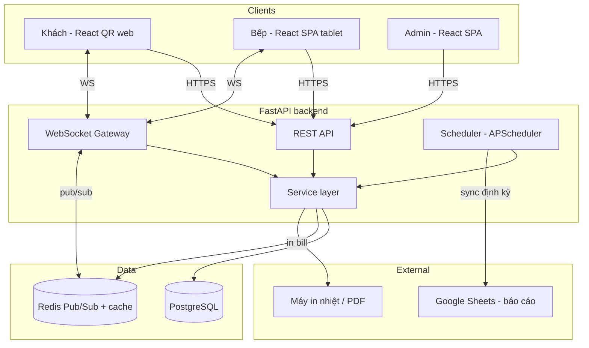
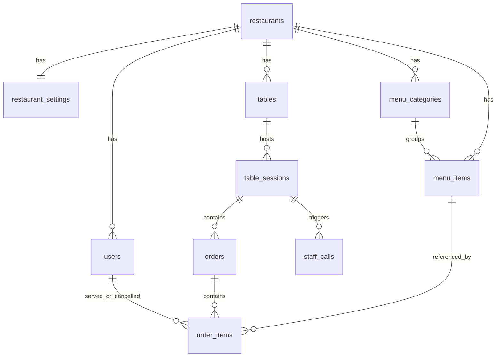
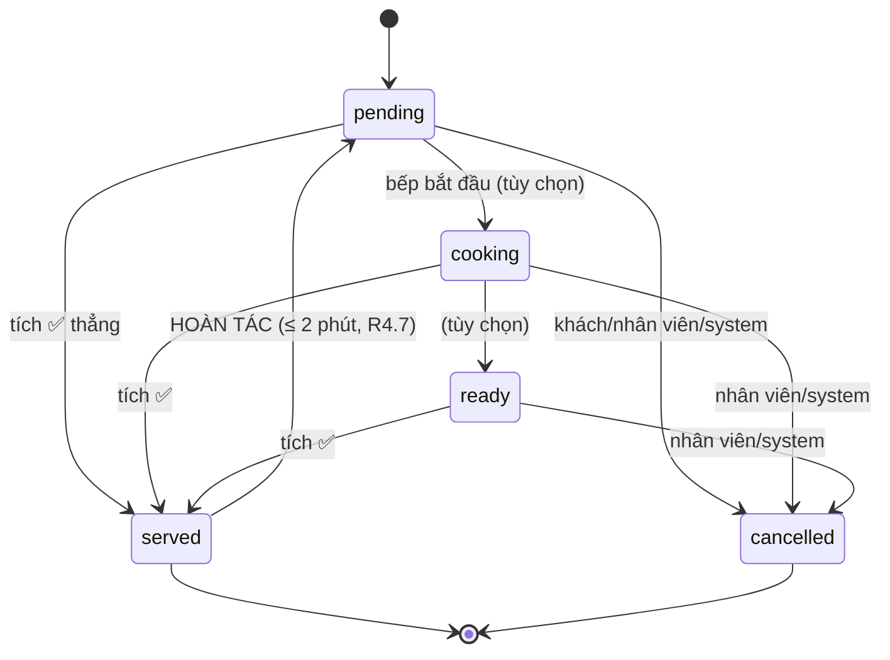
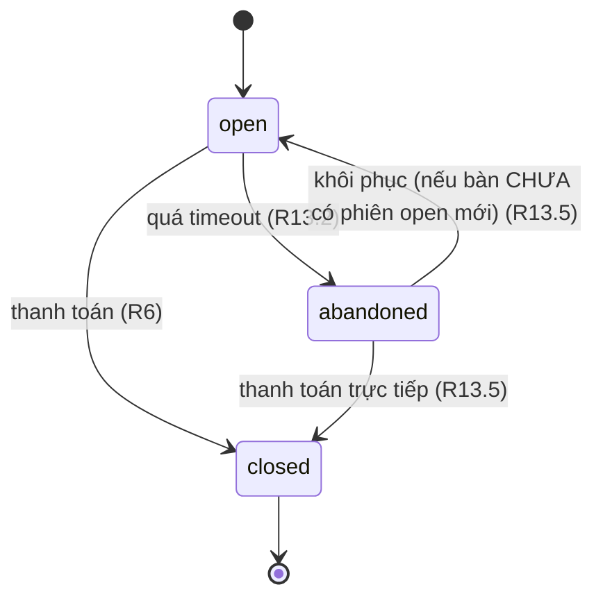
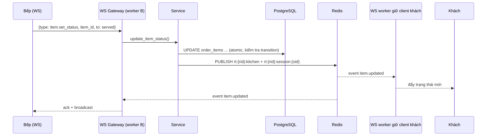

# Design Document — QOrder MVP

## Overview

QOrder là hệ thống đặt món qua QR cho quán bia/quán ăn, thiết kế multi-tenant ngay từ MVP. Tài liệu này mô tả kiến trúc, schema, luồng trạng thái, cơ chế realtime và đồng bộ báo cáo, bám sát `requirements.md` (13 requirement).

Nguyên tắc thiết kế chủ đạo:

- **PostgreSQL là source of truth** cho mọi dữ liệu nghiệp vụ; Redis chỉ dùng cho Pub/Sub realtime và trạng thái tạm.
- **`restaurant_id` xuyên suốt** mọi bảng để cô lập tenant (R1, R10.6).
- **`overdue_level` tính động**, không lưu DB (R5.5).
- **Snapshot giá/tên/prep_time** vào `order_items` tại thời điểm gọi để bill không đổi khi menu thay đổi về sau.
- Trạng thái là **máy trạng thái tường minh**, chuyển trạng thái là thao tác atomic (R4.6).

### Tech stack (theo tài liệu tổng hợp)

| Layer | Công nghệ |
|---|---|
| Backend | FastAPI (async) + SQLAlchemy 2.0 async + Alembic |
| DB | PostgreSQL (Supabase giai đoạn đầu) |
| Realtime | WebSocket (FastAPI) + Redis Pub/Sub |
| Cache/tạm | Redis |
| Frontend khách | React (Vite) + TailwindCSS |
| Frontend bếp/admin | React SPA + TailwindCSS |
| QR | thư viện `qrcode` (Python) |
| In bill | `python-escpos` (nhiệt) / `weasyprint` (PDF) |
| Báo cáo | `gspread` + Google Service Account |
| Deploy | Railway/Render (giai đoạn 1) → Docker/VPS |

## Architecture

### Sơ đồ thành phần



### Vì sao cần Redis Pub/Sub cho realtime

FastAPI có thể chạy nhiều worker/process. Một cập nhật trạng thái xảy ra ở worker A phải đẩy tới client đang giữ WebSocket ở worker B. Redis Pub/Sub làm lớp fan-out giữa các worker: service ghi DB xong → publish event lên kênh Redis → mọi worker subscribe kênh đó → đẩy xuống WebSocket client tương ứng. Đây là lý do R10.3 nâng Redis lên `SHALL`.

### Phân tầng code

```
qorder_api/
  main.py                # khởi tạo app, mount routers, WS
  config.py              # settings (env)
  db.py                  # async engine, session
  models/                # SQLAlchemy models
  schemas/               # Pydantic request/response
  services/              # business logic (state machine, billing, session)
  api/                   # REST routers
  ws/                    # WebSocket gateway + Redis pub/sub bridge
  realtime/              # event types, publisher, channel naming
  reporting/             # gspread sync jobs
  printing/              # escpos + weasyprint
  auth/                  # PIN/JWT, dependencies (role guards)
  scheduler.py           # APScheduler jobs (abandon sweep, report sync)
```

## Data Models

### ERD



### Bảng chi tiết (PostgreSQL)

Quy ước: khóa chính `id UUID DEFAULT gen_random_uuid()`, `created_at TIMESTAMPTZ DEFAULT now()`. Mọi bảng nghiệp vụ có `restaurant_id` + index.

#### 1. `restaurants`
| Cột | Kiểu | Ghi chú |
|---|---|---|
| id | UUID PK | |
| slug | TEXT UNIQUE NOT NULL | dùng trong URL/QR (R1.5) |
| name | TEXT NOT NULL | |
| is_active | BOOLEAN DEFAULT true | R1.4 |
| created_at | TIMESTAMPTZ | |

#### 2. `restaurant_settings` (1–1 với restaurant)
| Cột | Kiểu | Ghi chú |
|---|---|---|
| restaurant_id | UUID PK FK→restaurants | |
| currency | TEXT DEFAULT 'VND' | R1.3 |
| logo_url | TEXT NULL | |
| timezone | TEXT DEFAULT 'Asia/Ho_Chi_Minh' | dùng cho báo cáo/scheduler |
| default_savory_minutes | INT DEFAULT 10 | preset gợi ý (R5.3) |
| default_light_minutes | INT DEFAULT 5 | preset gợi ý (R5.3) |
| session_timeout_hours | INT DEFAULT 6 | R13.2/R13.3 |
| kitchen_screen_requires_pin | BOOLEAN DEFAULT true | R12.9 |
| staff_call_cooldown_seconds | INT DEFAULT 60 | R7.4 |
| report_sheet_id | TEXT NULL | mapping Google Sheet (R9.2) |
| report_sync_cron | TEXT DEFAULT '0 * * * *' | lịch đồng bộ (R9.1) — mặc định mỗi giờ |
| updated_at | TIMESTAMPTZ | |

#### 3. `users` (gộp staff + admin, sẵn sàng tách vai trò — R12.7)
| Cột | Kiểu | Ghi chú |
|---|---|---|
| id | UUID PK | |
| restaurant_id | UUID FK | R12.4 |
| role | TEXT NOT NULL | enum: `staff`, `admin` (mở rộng `kitchen`, `waiter` sau) |
| email | TEXT NULL | dùng cho admin (R12.3) |
| password_hash | TEXT NULL | admin (R12.6) |
| pin_hash | TEXT NULL | staff — PIN chung của quán (R12.2, R12.6) |
| display_name | TEXT NULL | |
| is_active | BOOLEAN DEFAULT true | |
| created_at | TIMESTAMPTZ | |

Ghi chú: giai đoạn 1 mỗi quán có 1 bản ghi `role='staff'` chứa PIN chung + 1+ bản ghi `role='admin'`. `email` unique theo `(restaurant_id, email)`.

**CHECK constraint** (tránh dữ liệu rác, làm ngay trong migration):
```sql
CHECK (
  (role = 'admin' AND email IS NOT NULL AND password_hash IS NOT NULL)
  OR
  (role = 'staff' AND pin_hash IS NOT NULL)
)
```

#### 4. `tables`
| Cột | Kiểu | Ghi chú |
|---|---|---|
| id | UUID PK | |
| restaurant_id | UUID FK | |
| label | TEXT NOT NULL | "Bàn 1", "B12"... |
| qr_token | TEXT UNIQUE NOT NULL | ngẫu nhiên, ánh xạ QR→bàn (R2.1); sinh lại để thu hồi (R2.6) |
| is_active | BOOLEAN DEFAULT true | |
| created_at | TIMESTAMPTZ | |

`qr_token`: sinh bằng `secrets.token_urlsafe(16)`, có index unique.

#### 5. `menu_categories`
| Cột | Kiểu | Ghi chú |
|---|---|---|
| id | UUID PK | |
| restaurant_id | UUID FK | |
| name | TEXT NOT NULL | "Bia", "Đồ nhắm"... |
| sort_order | INT DEFAULT 0 | |
| is_active | BOOLEAN DEFAULT true | |

#### 6. `menu_items`
| Cột | Kiểu | Ghi chú |
|---|---|---|
| id | UUID PK | |
| restaurant_id | UUID FK | |
| category_id | UUID FK→menu_categories NULL | |
| name | TEXT NOT NULL | |
| price | NUMERIC(12,2) NOT NULL | |
| prep_time_minutes | INT NOT NULL CHECK (>= 0) | R5.2; `0` = phục vụ ngay, không countdown |
| is_available | BOOLEAN DEFAULT true | còn/hết hàng (R3.2) |
| is_active | BOOLEAN DEFAULT true | ẩn/hiện khỏi menu (R8.1) |
| created_at / updated_at | TIMESTAMPTZ | |

#### 7. `table_sessions`
| Cột | Kiểu | Ghi chú |
|---|---|---|
| id | UUID PK | |
| restaurant_id | UUID FK | |
| table_id | UUID FK→tables | |
| status | TEXT NOT NULL DEFAULT 'open' | enum: `open`, `closed`, `abandoned` (R13.1) |
| opened_by | UUID FK→users NULL | null nếu khách tự mở qua QR (R12.2) |
| opened_at | TIMESTAMPTZ DEFAULT now() | |
| last_activity_at | TIMESTAMPTZ DEFAULT now() | mốc tính auto-abandon (R13.2) |
| closed_at | TIMESTAMPTZ NULL | |
| abandoned_at | TIMESTAMPTZ NULL | mốc tính hạn 24h khôi phục (R13.5/13.7) |
| total_amount | NUMERIC(12,2) NULL | tính & lưu tại thời điểm `closed` (R6.1); phiên `abandoned` để **NULL** (không tính doanh thu — R13.4); phiên `open` cũng NULL (tính động khi cần) |

**Ràng buộc quan trọng (R13.6):** tối đa 1 phiên `open`/bàn:
```sql
CREATE UNIQUE INDEX uq_one_open_session_per_table
ON table_sessions (table_id)
WHERE status = 'open';
```

#### 8. `orders`
| Cột | Kiểu | Ghi chú |
|---|---|---|
| id | UUID PK | |
| restaurant_id | UUID FK | |
| table_session_id | UUID FK→table_sessions | nhiều order/phiên (R3.4) |
| created_at | TIMESTAMPTZ | |

#### 9. `order_items`
| Cột | Kiểu | Ghi chú |
|---|---|---|
| id | UUID PK | |
| restaurant_id | UUID FK | |
| order_id | UUID FK→orders | |
| menu_item_id | UUID FK→menu_items | |
| name_snapshot | TEXT NOT NULL | snapshot tên tại lúc gọi |
| price_snapshot | NUMERIC(12,2) NOT NULL | snapshot giá |
| prep_time_snapshot | INT NOT NULL CHECK (>= 0) | snapshot prep_time (dùng tính overdue) |
| quantity | INT NOT NULL CHECK (> 0) | |
| note | TEXT NULL | ghi chú món (R3.5) |
| status | TEXT NOT NULL DEFAULT 'pending' | enum: `pending`,`cooking`,`ready`,`served`,`cancelled` |
| requested_at | TIMESTAMPTZ DEFAULT now() | mốc tính countdown/overdue (R5.2) |
| served_by | UUID FK→users NULL | R4.7 |
| served_at | TIMESTAMPTZ NULL | R4.7 |
| cancelled_by | TEXT NULL | enum: `customer`,`staff`,`system` (R11.7) |
| cancelled_at | TIMESTAMPTZ NULL | |
| cancel_reason | TEXT NULL | vd `table_closed`, `session_abandoned` |

#### 10. `staff_calls` (R7)
| Cột | Kiểu | Ghi chú |
|---|---|---|
| id | UUID PK | |
| restaurant_id | UUID FK | |
| table_id | UUID FK→tables | |
| table_session_id | UUID FK→table_sessions NOT NULL | mọi call luôn gắn 1 phiên (R2.4) |
| status | TEXT DEFAULT 'pending' | enum: `pending`, `acknowledged` |
| created_at | TIMESTAMPTZ DEFAULT now() | dùng cho cooldown 60s (R7.4) |
| acknowledged_at | TIMESTAMPTZ NULL | R7.3 |
| acknowledged_by | UUID FK→users NULL | |

> Mapping Google Sheet (R9.2) đặt trong `restaurant_settings.report_sheet_id` thay vì bảng riêng, đủ cho MVP 1 mapping/quán.

## Components and Interfaces

### REST API (chính)

| Method & Path | Vai trò | Auth | Requirement |
|---|---|---|---|
| `GET /t/{qr_token}` | Resolve bàn + menu quán | Khách | R2.2, R3.1 |
| `GET /t/{qr_token}/session` | Snapshot phiên hiện hành + items (resync) | Khách | R4.8 |
| `POST /t/{qr_token}/orders` | Gửi order mới | Khách | R3.3, R3.4 |
| `POST /t/{qr_token}/items/{item_id}/cancel` | Khách tự huỷ món `pending` | Khách | R11.2 |
| `POST /t/{qr_token}/call` | Gọi nhân viên (cooldown 60s) | Khách | R7.1, R7.4 |
| `GET /kitchen/board` | Snapshot bảng bếp (item chưa xong) | Staff | R4, R5 |
| `POST /kitchen/items/{id}/status` | Đổi trạng thái món (kể cả undo ≤2') | Staff | R4.1–4.7 |
| `POST /kitchen/items/{id}/cancel` | NV huỷ món | Staff | R11.4 |
| `POST /kitchen/calls/{id}/ack` | Tiếp nhận gọi NV | Staff | R7.3 |
| `POST /sessions/{id}/checkout` | Thanh toán, đóng bàn, in bill | Staff | R6 |
| `POST /sessions/{id}/restore` | Khôi phục phiên `abandoned` | Staff | R13.5 |
| `POST /tables/{id}/open` | Mở bàn thủ công | Staff | R12.2 |
| `POST /auth/staff/login` | Đăng nhập PIN → JWT | — | R12.2 |
| `POST /auth/admin/login` | Đăng nhập admin → JWT | — | R12.3 |
| `POST /auth/ws-ticket` | Cấp ticket 1 lần để mở WebSocket | Staff JWT nếu bật PIN; ẩn danh nếu tắt PIN | R4, R12.10 |
| `GET/POST/PATCH /admin/menu-items` | CRUD món | Admin | R8.1 |
| `GET/POST/PATCH /admin/tables` | CRUD bàn + sinh lại QR | Admin | R8.2, R2.5, R2.6 |
| `PATCH /admin/settings` | Sửa cấu hình quán | Admin | R8.3 |
| `POST /admin/staff/reset-pin` | Reset PIN staff | Admin | R12.8 |

### WebSocket

- `WS /ws/kitchen` (staff) — subscribe `rt:{restaurant_id}:kitchen`.
- `WS /ws/t/{qr_token}` (khách) — subscribe `rt:{restaurant_id}:session:{session_id}`.
- Message format đã mô tả ở mục Realtime.

**Xác thực WebSocket (staff) — cơ chế ticket dùng 1 lần:**

Trình duyệt không set được custom header khi handshake WS, nên không truyền JWT qua header như REST. QOrder dùng **ticket ngắn hạn, dùng 1 lần**:

1. Client gọi `POST /auth/ws-ticket` → server sinh `ticket = token_urlsafe(32)`, lưu Redis `ws_ticket:{ticket} → {restaurant_id, role}` với TTL 30s.
2. Client mở `WS /ws/kitchen?ticket={ticket}`.
3. Gateway đọc ticket từ Redis, `GETDEL` (dùng 1 lần), xác thực `restaurant_id`/`role` rồi mới cho subscribe; ticket sai/hết hạn → đóng WS 4401.

**Cấp ticket theo `kitchen_screen_requires_pin` (tránh "tắt PIN = tắt luôn bếp"):**
- IF `kitchen_screen_requires_pin = true` → `POST /auth/ws-ticket` yêu cầu **Staff JWT**; ticket mang `role=staff` + `user_id`.
- IF `kitchen_screen_requires_pin = false` → endpoint cho phép cấp ticket **ẩn danh** chỉ cần định danh quán (slug/`restaurant_id`), **không cần JWT**; ticket mang `role=staff` nhưng `user_id=null` (khớp hành vi ghi `served_by=null` ở R12.10). Server đọc `kitchen_screen_requires_pin` để quyết định nhánh nào.

Ưu điểm so với truyền JWT qua query string: JWT không xuất hiện trong log server/proxy; ticket TTL ngắn và one-shot nên rủi ro lộ tối thiểu. Khách (ẩn danh) không cần ticket — chỉ cần `qr_token` hợp lệ.

### Service interfaces (nội bộ)

- `SessionService`: `get_or_open(table)`, `checkout(session)`, `restore(session)`, `sweep_abandoned()`.
- `OrderService`: `create_order(session, items)`, `cancel_item(item, by, reason)`.
- `ItemStateService`: `set_status(item, to, actor)` — enforce bảng transition; `compute_overdue_level(item, now)`.
- `StaffCallService`: `create(table)` (cooldown), `ack(call, actor)`.
- `RealtimePublisher`: `publish(channel, event)` qua Redis.
- `AuthService`: `login_staff(pin)`, `login_admin(email, pwd)`, `guard(role)`.
- `BillingService`: `compute_total(session)` (chỉ item `served`).
- `PrintingService`: `print_bill(session)` → escpos, fallback PDF.
- `ReportSyncService`: `sync(restaurant)` → gspread.

## Máy trạng thái

### `order_item.status`



Quy tắc chuyển hợp lệ (enforce ở service layer):
- Tiến: `pending → cooking → ready → served`, cho phép nhảy cóc tới `served`.
- `cancelled` từ mọi trạng thái chưa `served` (R11).
- Lùi duy nhất được phép: `served → pending` trong ≤ 2 phút kể từ `served_at` (R4.7).
- Khách chỉ tự huỷ khi `pending` (R11.2/11.3).

### `table_session.status`



## Cơ chế `overdue_level` (tính động)

Chỉ áp dụng cho item có `prep_time_snapshot > 0` và `status ∉ {served, cancelled}`.

```
elapsed_min = (now - requested_at) tính theo phút
prep = prep_time_snapshot

nếu prep == 0            → không countdown, không nhấp nháy (R5.1)
ratio = elapsed_min / prep

overdue_level:
  0  nếu ratio < 1.0      (đúng hạn — nhấp nháy chậm)
  1  nếu 1.0 ≤ ratio < 1.5 (trễ nhẹ)
  2  nếu 1.5 ≤ ratio < 2.0 (trễ vừa)
  3  nếu ratio ≥ 2.0       (trễ nặng — nhấp nháy nhanh nhất)
```

- Server **không lưu** `overdue_level` (R5.5). Payload realtime/REST trả `requested_at` + `prep_time_snapshot`; client tự tính level và ánh xạ ra tốc độ nhấp nháy → không cần server tick mỗi giây.
- Hiệu ứng nhấp nháy theo level chỉ hiển thị ở **màn hình bếp** (R5.7); màn khách chỉ hiện "đang chờ"/"đã ra".
- Bảng ánh xạ tốc độ (client): level 0 = 1.5s, 1 = 1s, 2 = 0.6s, 3 = 0.3s (cấu hình FE).

> **Ghi chú thay đổi có chủ ý:** bản tổng hợp ban đầu từng có ý tưởng `overdue_flash_multiplier` cho phép quán tự chỉnh tốc độ nhấp nháy. MVP **đơn giản hoá**: ngưỡng ratio (1.0/1.5/2.0) và tốc độ nhấp nháy cố định ở tầng client, không cấu hình theo quán (R5.4 không bắt buộc cấu hình được). Nếu giai đoạn 2 cần, thêm lại field vào `restaurant_settings` mà không phá schema hiện tại.

## Realtime (WebSocket + Redis)

### Kênh (channel) đặt theo tenant

- `rt:{restaurant_id}:kitchen` — mọi cập nhật cho màn bếp (item status, order mới, staff_call, session close/abandon).
- `rt:{restaurant_id}:session:{session_id}` — cập nhật cho khách của đúng phiên đó.

### Luồng một cập nhật (ví dụ tích ✅)



### Định dạng message (JSON)

Client → server:
```json
{ "type": "item.set_status", "item_id": "...", "to": "served" }
{ "type": "item.cancel", "item_id": "...", "reason": "..." }
{ "type": "staff_call.ack", "call_id": "..." }
```

Server → client (event):
```json
{ "type": "item.updated", "item": { "id": "...", "status": "served",
  "requested_at": "...", "prep_time": 10, "served_at": "..." } }
{ "type": "order.created", "order": { ... , "items": [ ... ] } }
{ "type": "staff_call.new", "call": { "table_label": "Bàn 5", "call_id": "..." } }
{ "type": "session.closed", "session_id": "..." }
```

### Resync sau mất kết nối (R4.6)

Khi WS (re)connect, client gọi REST snapshot rồi mới nghe event:
- Bếp: `GET /kitchen/board` → mọi item chưa `served`/`cancelled` của quán.
- Khách: `GET /t/{qr_token}/session` → phiên hiện hành + toàn bộ item.

Client dùng `updated_at`/thứ tự event để tránh áp event cũ đè trạng thái mới hơn.

## Các luồng nghiệp vụ chính

### Quét QR & mở phiên (R2, R13.6)
1. `GET /t/{qr_token}` → resolve bàn; nếu token/bàn/quán không hợp lệ → trang lỗi (R2.3).
2. Tìm phiên `open` của bàn. Nếu chưa có → tạo phiên `open` (`opened_by = null`).
3. Việc tạo phiên dựa vào unique partial index để tránh race: nếu 2 request đồng thời cùng tạo, một cái sẽ vi phạm index → retry đọc phiên vừa tạo.

### Gọi món (R3)
1. `POST /t/{qr_token}/orders` body = danh sách item. Từ chối nếu rỗng (R3.6) hoặc phiên không `open`.
2. Với mỗi dòng: kiểm tra `menu_item.is_available` (R3.2); snapshot name/price/prep_time; tạo `order_items` status `pending`, `requested_at = now()`.
3. Cập nhật `session.last_activity_at`. Publish `order.created`.

### Cập nhật trạng thái & hoàn tác (R4)
- `update_item_status(item, to, actor)` dùng **compare-and-swap atomic** trong 1 câu SQL, không phụ thuộc đọc-rồi-ghi (tránh race giữa 2 nhân viên tích cùng lúc — R4.6, Property 4):
  ```sql
  UPDATE order_items
  SET status = :to, served_at = :served_at, served_by = :actor
  WHERE id = :id AND status = ANY(:allowed_from)
  RETURNING *;
  ```
  - `:allowed_from` = tập trạng thái nguồn hợp lệ cho `:to` (tra từ bảng transition).
  - Nếu `RETURNING` **không có dòng nào** → có người đã đổi trạng thái trước → trả **409 Conflict** (transition thất bại).
- Hoàn tác `served → pending`: `:allowed_from = {served}` kèm điều kiện `now - served_at ≤ interval '120 seconds'` ngay trong `WHERE`.
- Cập nhật `session.last_activity_at = now()`; publish event.

### Huỷ món (R11)
- Dùng cùng pattern **compare-and-swap** như đổi trạng thái để tránh đua với lúc bếp tích ✅:
  ```sql
  UPDATE order_items SET status='cancelled', cancelled_by=:by,
    cancelled_at=now(), cancel_reason=:reason
  WHERE id=:id AND status = ANY(:allowed_from) RETURNING *;
  ```
- Khách: `:allowed_from = {pending}` của phiên mình; `cancelled_by='customer'` (R11.2/11.3).
- Nhân viên: `:allowed_from = {pending, cooking, ready}`; `cancelled_by='staff'`, `cancel_reason` tùy chọn (R11.4).
- `RETURNING` rỗng (món vừa được tích `served` hoặc đã huỷ) → 409, báo mềm cho người thao tác. Publish; item bị loại khỏi tính bill.

### Thanh toán & đóng bàn (R6)
1. Nếu còn item `pending/cooking/ready` → trả cảnh báo + danh sách (R6.7); FE xác nhận.
2. Khi xác nhận: transaction bắt đầu bằng **CAS đóng phiên** để không đua với job auto-abandon (xem mục "Chống race checkout vs auto-abandon"):
   ```sql
   UPDATE table_sessions SET status='closed', closed_at=now()
   WHERE id=:id AND status='open' RETURNING *;
   ```
   - Nếu `RETURNING` rỗng (phiên vừa bị sweep đánh `abandoned`, hoặc đã đóng) → hủy transaction, trả thông báo mềm "Bàn vừa được hệ thống đóng do quá thời gian chờ, vui lòng khôi phục để thanh toán" (điều hướng sang luồng R13.5).
   - Nếu thắng CAS: chuyển các item chưa served sang `cancelled` (`cancelled_by='system'`, `cancel_reason='table_closed'`) (R6.8), tính `total_amount` chỉ gồm item `served` (R6.9), ghi `total_amount`; **dismiss mọi `staff_calls` pending** của phiên.
3. In bill: thử ESC/POS; lỗi/không có máy in → sinh PDF (R6.3/6.4).
4. Publish `session.closed`.

### Gọi nhân viên (R7)
- `POST /t/{qr_token}/call`: kiểm tra cooldown (bản ghi `staff_calls` gần nhất của bàn trong 60s → bỏ qua, trả thông báo nhẹ). Ngược lại tạo call `pending`, **cập nhật `session.last_activity_at = now()`** (gọi nhân viên là hoạt động ngăn auto-abandon theo R13.2), publish `staff_call.new`.
- `POST /staff/calls/{id}/ack`: set `acknowledged`, publish.
- **Dọn call mồ côi:** khi phiên chuyển `closed`/`abandoned`, mọi `staff_calls` còn `pending` của phiên/bàn đó SHALL được set `acknowledged` (dismiss) để không kẹt trên board bếp.

### Auto-abandon (R13) — scheduler
- Job chạy mỗi ~5 phút: tìm phiên `open` có `last_activity_at < now - session_timeout_hours`, rồi với mỗi phiên dùng **CAS** để đánh dấu (không đua với checkout thủ công):
  ```sql
  UPDATE table_sessions SET status='abandoned', abandoned_at=now()
  WHERE id=:id AND status='open' RETURNING *;
  ```
  - Nếu `RETURNING` rỗng (nhân viên vừa checkout xong phiên đó) → bỏ qua phiên này, không xử lý gì thêm.
  - Nếu thắng CAS: huỷ item chưa xong (`cancelled_by='system'`, reason `session_abandoned`) (R13.8); `total_amount` để **NULL** (R13.4 — không tính doanh thu); **dismiss `staff_calls` pending** của phiên; publish.

### Chống race checkout vs auto-abandon
Redis lock chỉ chống nhiều scheduler instance giành nhau chạy job, **không** chống được race giữa scheduler và nhân viên bấm checkout gần như đồng thời trên cùng một phiên. Cả 2 đường ghi `table_sessions.status` đều dùng **compare-and-swap trên `WHERE status='open'`**: bên nào ghi trước thắng, bên sau đọc `RETURNING` rỗng thì tự bỏ qua (checkout báo mềm, sweep skip). Đây là cùng pattern với đổi trạng thái `order_items`.
- Khôi phục (R13.5): nếu bàn chưa có phiên `open` khác → cho `abandoned → open`; nếu đã có → chỉ cho `abandoned → closed` (thanh toán trực tiếp). Chặn thao tác nếu quá 24h kể từ `abandoned_at` (R13.7).

### Chống trùng job trên nhiều instance (scheduler)
Khi deploy >1 replica (hoặc restart chồng lấn), mỗi process chạy APScheduler riêng → job có thể chạy trùng (đặc biệt report sync ghi Sheets 2 lần). Giải pháp: **Redis distributed lock** bọc quanh mỗi lần chạy job:
```
if redis.set("lock:job:{name}", instance_id, nx=True, ex=lock_ttl):
    try: run_job()
    finally: release nếu vẫn giữ lock
```
- `lock_ttl` > thời gian chạy job tối đa dự kiến. Chỉ 1 instance thắng lock mới chạy; các instance khác bỏ qua lượt đó.
- Auto-abandon vốn idempotent (điều kiện `status='open'`) nên rủi ro thấp, nhưng vẫn bọc lock cho nhất quán. Report sync **bắt buộc** bọc lock để tránh ghi trùng.

## Auth & phân quyền (R12)

- **Khách**: ẩn danh, không auth; truy cập bằng `qr_token` (R12.1).
- **Staff**: đăng nhập PIN chung → nhận JWT ngắn hạn (claim `role=staff`, `restaurant_id`). Guard cho các route: đổi trạng thái, huỷ, ack call, thanh toán, mở bàn thủ công, khôi phục phiên (R12.2).
  - Nếu `kitchen_screen_requires_pin=false` (R12.10): route bếp bỏ guard PIN; hành động ghi `served_by=null`/`cancelled_by='staff'` ẩn danh.
- **Admin**: đăng nhập email+password → JWT `role=admin`; truy cập quản lý menu/bàn/settings/báo cáo (R12.3), reset PIN staff (R12.8).
- Mật khẩu/PIN hash bằng `bcrypt`/`argon2` (R12.6). Mọi truy vấn kèm `restaurant_id` từ claim để cô lập tenant (R12.4, R10.6).
- Thiếu/hết hạn token trên route cần quyền → 401/403 (R12.5).

## Admin & menu (R8)
- CRUD `menu_items` (prep_time bắt buộc; preset mặn/nhạt điền sẵn từ settings — R8.1), `menu_categories`, `tables` (sinh/sinh lại `qr_token`, xuất QR PNG — R2.5/2.6), `restaurant_settings`.
- Nhập menu ban đầu từ Google Sheet (R8.4) là tùy chọn, dùng `gspread` đọc 1 lần.

## Báo cáo Google Sheets (R9)
- Job scheduler theo `report_sync_cron` (mặc định mỗi giờ): tổng hợp doanh thu theo ngày, món bán chạy (đếm `order_items` `served`), ghi vào sheet `report_sheet_id` qua `gspread` + Service Account.
- **Không** đọc/ghi Sheets cho dữ liệu live (R9.3). Lỗi sync → log + retry lần sau, không ảnh hưởng vận hành (R9.4).

## In bill (R6.3/6.4)
- `printing/escpos_printer.py`: in nhiệt qua `python-escpos` (USB/network).
- `printing/pdf_printer.py`: `weasyprint` render template HTML → PDF fallback.
- Bill gồm: tên quán, số bàn, danh sách món + SL + đơn giá, tổng, thời gian (R6.5).

## Error Handling

- **Validation**: Pydantic + trả 422 chi tiết. Giỏ rỗng/391 nghiệp vụ → 400 với mã lỗi rõ.
- **Transition không hợp lệ**: service raise `InvalidTransition` → 409 Conflict.
- **Race tạo phiên**: bắt `UniqueViolation` trên partial index → đọc lại phiên `open` hiện có.
- **Tenant isolation**: mọi query lọc `restaurant_id`; truy cập chéo → 404 (không lộ tồn tại). Ở MVP cô lập hoàn toàn ở **tầng application** (Property 2). **Ghi chú giai đoạn 2:** khi lên SaaS thật nên cân nhắc bật **PostgreSQL Row-Level Security (RLS)** làm lớp phòng thủ thứ 2 (defense in depth) — `restaurant_id` đã denormalize sẵn ở mọi bảng nên bật RLS về sau không cần đổi schema.
- **Realtime**: publish lỗi Redis được log, không chặn ghi DB (DB là source of truth; client resync bù).
- **In bill**: ESC/POS lỗi → tự chuyển PDF; luôn trả link/preview bill kể cả khi in fail.
- **Sheets sync**: bọc try/except, log, retry theo cron; circuit đơn giản để không spam API.

## Correctness Properties

Các bất biến hệ thống phải luôn giữ (dùng làm cơ sở test):

### Property 1: Một phiên open trên mỗi bàn
Với mọi `table`, số `table_sessions` có `status='open'` luôn ≤ 1 (đảm bảo bằng unique partial index).
**Validates: Requirements 13.6**

### Property 2: Cô lập tenant
Mọi bản ghi trả về cho một request luôn có `restaurant_id` khớp claim/quán trong ngữ cảnh; không có đường dẫn nào trả dữ liệu chéo quán.
**Validates: Requirements 1.2, 10.6**

### Property 3: Bill chỉ gồm món đã phục vụ
`session.total_amount = Σ(price_snapshot × quantity)` trên các item `status='served'`; item `cancelled` không bao giờ được tính.
**Validates: Requirements 6.9, 11.5**

### Property 4: Transition hợp lệ
`order_item.status` chỉ đổi theo tập chuyển cho phép; lùi trạng thái chỉ xảy ra với `served → pending` khi `now - served_at ≤ 120s`.
**Validates: Requirements 4.7**

### Property 5: Không món mồ côi nhấp nháy
Khi `session` rời `open` (sang `closed`/`abandoned`), mọi item của phiên đều ở trạng thái kết thúc (`served`/`cancelled`), không còn item `pending/cooking/ready`.
**Validates: Requirements 6.8, 13.8**

### Property 6: Overdue tính động, không lưu
`overdue_level` luôn suy ra được từ `requested_at` + `prep_time_snapshot` + thời điểm hiện tại; không có cột nào lưu `overdue_level`; item `prep_time_snapshot=0` luôn có level = "không countdown".
**Validates: Requirements 5.1, 5.5**

### Property 7: Cooldown gọi nhân viên
Với mỗi bàn, hai `staff_calls` liên tiếp cách nhau ≥ `staff_call_cooldown_seconds` (mặc định 60).
**Validates: Requirements 7.4**

### Property 8: Snapshot bất biến giá
Thay đổi `menu_items.price` sau khi món đã vào `order_items` không làm đổi `price_snapshot` đã lưu.
**Validates: Requirements 6.1, 6.5**

### Property 9: Hạn khôi phục 24h
Không thao tác `abandoned → open/closed` nào được chấp nhận khi `now - abandoned_at > 24h`.
**Validates: Requirements 13.7**

## Testing Strategy

- **Unit**: state machine (`order_item`, `session`), công thức `overdue_level` (các mốc ratio biên), tính tổng bill (loại cancelled), cooldown gọi NV.
- **Integration (pytest + DB test)**: luồng quét QR→gọi→tích→thanh toán; auto-abandon + huỷ item hệ thống; khôi phục phiên theo 2 nhánh R13.5; ràng buộc 1 phiên open/bàn (test race bằng 2 request đồng thời).
- **Auth**: guard theo role; bật/tắt `kitchen_screen_requires_pin`; cô lập tenant (quán A không đọc được dữ liệu quán B).
- **Realtime**: test publish→subscribe qua Redis fakeredis; resync snapshot khớp trạng thái.
- **E2E (sau, tùy chọn)**: Playwright cho luồng khách + bếp cơ bản.
- Ưu tiên MVP: unit + integration cho state machine, billing, session lifecycle, tenant isolation.
