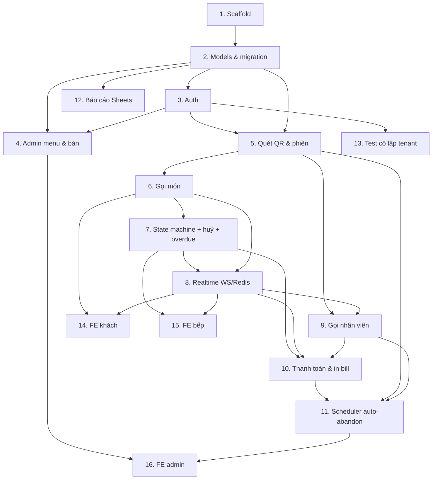

# Implementation Plan — QOrder MVP

## Overview

Kế hoạch triển khai tăng dần. Mỗi task chỉ động tới code, có thể chạy/test được, và map tới requirement. Backend (FastAPI) làm trước để có API chạy được, frontend làm sau. Ưu tiên test cho state machine, billing, session lifecycle, tenant isolation.

## Tasks

- [x] 1. Scaffold project & hạ tầng dev
  - Tạo cấu trúc `qorder_api/` (models, schemas, services, api, ws, realtime, reporting, printing, auth, scheduler) theo design.
  - Thêm `pyproject.toml`/`requirements.txt`: fastapi, uvicorn, sqlalchemy[asyncio], asyncpg, alembic, pydantic-settings, redis, python-jose, passlib[bcrypt], apscheduler.
  - `config.py` đọc env (DATABASE_URL, REDIS_URL, JWT_SECRET...); `db.py` tạo async engine + session factory.
  - `docker-compose.yml` cho Postgres + Redis local; `main.py` khởi tạo app + healthcheck `GET /health`.
  - _Requirements: 10.1, 10.2, 10.3, 10.4, 10.5_

- [x] 2. Định nghĩa models & Alembic migration đầu tiên
- [x] 2.1 Viết SQLAlchemy models cho 10 bảng
  - `restaurants`, `restaurant_settings`, `users`, `tables`, `menu_categories`, `menu_items`, `table_sessions`, `orders`, `order_items`, `staff_calls` theo schema đã chốt (kiểu, nullable, default).
  - Khai báo enum: `order_item_status`, `session_status`, `user_role`, `cancelled_by`, `staff_call_status`.
  - _Requirements: 1.1, 4.1, 11.1, 13.1, 12.7_
- [x] 2.2 Thêm ràng buộc & index ở tầng DB
  - Unique partial index `uq_one_open_session_per_table` (WHERE status='open').
  - CHECK: `menu_items.prep_time_minutes >= 0`, `order_items.prep_time_snapshot >= 0`, `order_items.quantity > 0`, `users` role/credential.
  - Unique `(restaurant_id, table_number)`, `tables.qr_token` unique, `(restaurant_id, email)` unique.
  - Index: `order_items (restaurant_id, status)`, `table_sessions (table_id, status)` + `(status, last_activity_at)`.
  - _Requirements: 13.6, 5.2, 3.3, 12.6, 2.1_
- [x] 2.3 Sinh & chạy Alembic migration, seed dữ liệu mẫu
  - Cấu hình Alembic async; tạo migration khởi tạo; script seed 1 quán + settings + 1 admin + 1 staff PIN + vài bàn + menu mẫu (gồm món `prep_time=0`).
  - _Requirements: 1.1, 1.3, 1.5_

- [x] 3. Auth & phân quyền
- [x] 3.1 Hash & tiện ích JWT
  - `passlib` hash/verify cho PIN và password; tạo/verify JWT (claim `role`, `restaurant_id`, `user_id`).
  - _Requirements: 12.6, 12.4_
- [x] 3.2 Endpoint đăng nhập + guard theo role
  - `POST /auth/staff/login` (PIN → JWT), `POST /auth/admin/login` (email+password → JWT).
  - Dependency `require_role(...)`; thiếu/sai token trên route cần quyền → 401/403; lọc `restaurant_id` từ claim.
  - _Requirements: 12.1, 12.2, 12.3, 12.5, 10.6_
- [x] 3.3 Reset PIN & bật/tắt PIN màn bếp
  - `POST /admin/staff/reset-pin`; đọc `restaurant_settings.kitchen_screen_requires_pin` trong guard bếp.
  - _Requirements: 12.8, 12.9, 12.10_
- [x] 3.4 WebSocket ticket 1 lần
  - `POST /auth/ws-ticket`: nhánh có PIN (cần Staff JWT) và nhánh tắt PIN (ẩn danh theo slug); lưu Redis TTL 30s; verify bằng `GETDEL`.
  - **Test**: ticket dùng 1 lần (lần thứ 2 thất bại/đóng WS 4401); hết hạn sau TTL 30s; cấp đúng nhánh theo `kitchen_screen_requires_pin` (bật PIN → cần Staff JWT, thiếu JWT bị từ chối; tắt PIN → cấp ẩn danh chỉ cần slug).
  - _Requirements: 12.10, 4.3_

- [x] 4. Quản lý menu & bàn (admin)
- [x] 4.1 CRUD menu_categories & menu_items
  - Tạo/sửa/ẩn (`is_active`), bật/tắt `is_available`; `prep_time_minutes` bắt buộc; preset mặn/nhạt điền sẵn từ settings.
  - _Requirements: 8.1, 3.2, 5.3_
- [x] 4.2 CRUD tables + sinh/sinh lại qr_token + xuất QR
  - Sinh `qr_token` bằng `secrets.token_urlsafe`; endpoint sinh lại token (thu hồi QR cũ); render QR PNG (thư viện `qrcode`).
  - _Requirements: 8.2, 2.1, 2.5, 2.6_
- [x] 4.3 Sửa restaurant_settings
  - PATCH settings (countdown preset, timeout, cờ PIN, cooldown, currency, report_sheet_id...).
  - _Requirements: 8.3, 1.3_

- [x] 5. Quét QR & vòng đời phiên bàn (nền tảng)
- [x] 5.1 Resolve QR + snapshot menu cho khách
  - `GET /t/{qr_token}` → quán+bàn+menu (chỉ món `is_active`, đánh dấu `is_available`); token/bàn/quán không hợp lệ → lỗi thân thiện.
  - _Requirements: 2.2, 2.3, 3.1, 3.2_
- [x] 5.2 Mở/dùng lại phiên (chống race) + snapshot phiên
  - `SessionService.get_or_open(table)` dựa unique partial index, bắt `UniqueViolation` → đọc lại phiên open; `GET /t/{qr_token}/session` trả snapshot (resync).
  - `POST /tables/{id}/open` mở bàn thủ công (staff, `opened_by`).
  - _Requirements: 2.4, 13.6, 4.8, 12.2_

- [x] 6. Gọi món
  - `POST /t/{qr_token}/orders`: từ chối giỏ rỗng/phiên không open; kiểm tra `is_available`; snapshot name/price/prep_time; tạo `order` + `order_items` (`pending`, `requested_at`); cập nhật `last_activity_at`.
  - _Requirements: 3.3, 3.4, 3.5, 3.6, 6.6_

- [x] 7. State machine món ăn (CAS) + huỷ + overdue
- [x] 7.1 Đổi trạng thái bằng compare-and-swap
  - `ItemStateService.set_status`: `UPDATE ... WHERE status = ANY(:allowed_from) RETURNING *`; 0 dòng → 409; set `served_by/served_at`; undo `served→pending` ≤120s; cập nhật `last_activity_at`.
  - _Requirements: 4.1, 4.3, 4.4, 4.5, 4.6, 4.7_
- [x] 7.2 Huỷ món (CAS) cho khách & nhân viên
  - Khách: chỉ `pending`; nhân viên: mọi trạng thái chưa `served`; set `cancelled_by/at`, `cancel_reason`; loại khỏi bill.
  - _Requirements: 11.1, 11.2, 11.3, 11.4, 11.5, 11.7_
- [x] 7.3 Tính overdue_level & board bếp
  - `compute_overdue_level(item, now)` theo ratio (0/1/1.5/2.0), bỏ qua `prep_time=0` và `served/cancelled`; `GET /kitchen/board` trả item chưa xong + `requested_at`+`prep_time_snapshot`.
  - _Requirements: 5.1, 5.2, 5.4, 5.5, 5.6, 5.7_
- [x] 7.4 Unit test state machine, huỷ, overdue
  - Test transition hợp lệ/không hợp lệ, undo trong/ngoài 120s, các mốc ratio biên, loại cancelled khỏi bill.
  - _Requirements: 4.1, 4.7, 5.4, 11.5_

- [x] 8. Realtime (WebSocket + Redis Pub/Sub)
- [x] 8.1 Publisher & kênh theo tenant
  - `RealtimePublisher.publish(channel, event)`; kênh `rt:{rid}:kitchen`, `rt:{rid}:session:{sid}`; định nghĩa event types.
  - _Requirements: 4.3, 10.2_
- [x] 8.2 WS gateway + bridge Redis→client
  - `WS /ws/kitchen` (verify ticket) & `WS /ws/t/{qr_token}`; subscribe Redis, đẩy event; phát event ở các luồng: order mới (3.3), đổi trạng thái (4.3), huỷ món (11.6), gọi nhân viên (7.2), session đóng (6.2), session abandoned (13.4).
  - _Requirements: 4.3, 7.2, 10.2, 11.6, 6.2, 13.4_
- [x] 8.3 Resync khi reconnect
  - Client lấy snapshot REST trước khi nghe event; chống áp event cũ; test publish→subscribe qua fakeredis.
  - _Requirements: 4.8_

- [x] 9. Gọi nhân viên
- [x] 9.1 StaffCallService + endpoints
  - `StaffCallService`: `create(table)` (cooldown per-bàn 60s), `ack(call, actor)`, và **`dismiss_pending(session_id)`** dùng chung (tái dùng ở checkout 10.1 và sweep 11.1 thay vì viết lặp).
  - `POST /t/{qr_token}/call`: bỏ qua nếu trong cooldown (báo mềm); cập nhật `last_activity_at`; publish. `POST /kitchen/calls/{id}/ack`: set `acknowledged`, publish.
  - _Requirements: 7.1, 7.2, 7.3, 7.4, 13.2_
- [x] 9.2 Test cooldown gọi nhân viên (Property 7)
  - Test 2 request gọi liên tiếp < 60s cho cùng bàn → chỉ 1 call được tạo; > 60s → tạo được call mới; cooldown độc lập giữa các bàn.
  - _Requirements: 7.4_

- [x] 10. Thanh toán, đóng bàn & in bill
- [x] 10.1 Checkout (CAS) + auto-cancel món dở + dismiss calls
  - `POST /sessions/{id}/checkout`: CAS `WHERE status='open'` (thua → báo mềm); auto-cancel item chưa served (`system`/`table_closed`); tính `total_amount` chỉ gồm `served`; **gọi `StaffCallService.dismiss_pending(session_id)`** (hàm chung từ 9.1, không viết lặp); publish `session.closed`.
  - _Requirements: 6.1, 6.2, 6.6, 6.7, 6.8, 6.9_
- [x] 10.2 In bill ESC/POS + fallback PDF
  - `PrintingService`: `python-escpos` in nhiệt; lỗi/không có máy in → `weasyprint` PDF; bill gồm tên quán, số bàn, món+SL+đơn giá, tổng, thời gian.
  - _Requirements: 6.3, 6.4, 6.5_
- [x] 10.3 Integration test luồng thanh toán & billing
  - Test tổng chỉ gồm `served` (Property 3), auto-cancel đúng reason `table_closed` (Property 5 nhánh checkout), không thêm order sau khi đóng, dismiss staff_calls pending.
  - **Test snapshot giá bất biến (Property 8)**: đổi `menu_items.price` sau khi món đã vào `order_items` → `price_snapshot` không đổi, tổng bill dùng giá snapshot.
  - _Requirements: 6.6, 6.8, 6.9, 6.1_

- [ ] 11. Scheduler: auto-abandon + khôi phục phiên
- [x] 11.1 Job sweep auto-abandon (CAS) + Redis lock
  - APScheduler mỗi ~5 phút; Redis lock `SET NX EX`; CAS `WHERE status='open'`; set `abandoned`, huỷ item dở (`session_abandoned`), **gọi `StaffCallService.dismiss_pending`** (hàm chung từ 9.1), `total_amount` NULL.
  - _Requirements: 13.2, 13.3, 13.4, 13.8_
- [x] 11.2 Khôi phục/thanh toán phiên abandoned
  - `POST /sessions/{id}/restore`: nếu bàn chưa có phiên open → về `open`; nếu đã có → chỉ cho checkout thẳng; chặn quá 24h.
  - _Requirements: 13.5, 13.6, 13.7_
- [ ] 11.3 Integration test lifecycle & race
  - Test 2 nhánh restore; race checkout↔sweep (CAS bên thua rỗng); bất biến 1 phiên open/bàn (Property 1).
  - **Test abandon auto-cancel món dở (Property 5 nhánh R13.8)**: sweep đánh `abandoned` → item chưa xong chuyển `cancelled`/`session_abandoned`, dừng nhấp nháy, dismiss calls.
  - **Test biên 24h khôi phục (Property 9)**: `abandoned_at` chưa quá 24h → restore/checkout được; vừa quá 24h → bị chặn.
  - _Requirements: 13.5, 13.6, 13.7, 13.8_

- [x] 12. Báo cáo Google Sheets
  - `ReportSyncService.sync(restaurant)` qua `gspread`+Service Account theo `report_sync_cron` (Redis lock); tổng hợp doanh thu/ngày + món bán chạy; lỗi → log+retry, không chặn vận hành; không dùng Sheets cho live data.
  - _Requirements: 9.1, 9.2, 9.3, 9.4_

- [ ] 13. Test cô lập tenant & auth (bảo mật)
  - Test quán A không đọc/ghi được dữ liệu quán B qua mọi route; guard theo role; bật/tắt `kitchen_screen_requires_pin`.
  - _Requirements: 1.2, 10.6, 12.2, 12.10_

- [x] 14. Frontend khách (React + Tailwind)
- [x] 14.1 Trang menu + giỏ hàng + gửi order
  - Quét QR mở `/{slug}/t/{qr_token}`; hiển thị menu theo nhóm, nhãn "Hết hàng", ghi chú món; gửi order; gọi thêm nhiều đợt.
  - _Requirements: 2.2, 3.1, 3.2, 3.5, 3.4_
- [x] 14.2 Trạng thái món realtime + gọi nhân viên
  - WS khách: hiển thị "đang chờ"/"đã ra" (không nhấp nháy khẩn cấp); nút gọi nhân viên + phản hồi cooldown; khách huỷ món `pending`.
  - _Requirements: 4.2, 5.7, 7.1, 11.2_

- [x] 15. Frontend bếp (React SPA)
  - Đăng nhập PIN (hoặc bỏ qua nếu tắt PIN) → lấy ws-ticket → WS board; hiển thị món chưa xong, nhấp nháy theo `overdue_level`; tích ✅/undo; huỷ món; nhận & ack gọi nhân viên; nút checkout + cảnh báo món dở.
  - _Requirements: 4.1, 4.4, 5.1, 5.7, 6.7, 7.2, 7.3, 11.4_

- [x] 16. Frontend admin (React SPA)
  - Đăng nhập admin; quản lý menu/nhóm/bàn (sinh & xuất QR); sửa settings; xem/khôi phục phiên abandoned; trigger đồng bộ báo cáo.
  - _Requirements: 8.1, 8.2, 8.3, 12.3, 13.5_

## Task Dependency Graph

```json
{
  "waves": [
    { "wave": 1, "tasks": ["1"] },
    { "wave": 2, "tasks": ["2"] },
    { "wave": 3, "tasks": ["3", "12"] },
    { "wave": 4, "tasks": ["4", "5", "13"] },
    { "wave": 5, "tasks": ["6"] },
    { "wave": 6, "tasks": ["7"] },
    { "wave": 7, "tasks": ["8"] },
    { "wave": 8, "tasks": ["9", "14", "15"] },
    { "wave": 9, "tasks": ["10"] },
    { "wave": 10, "tasks": ["11"] },
    { "wave": 11, "tasks": ["16"] }
  ]
}
```



## Notes

- **Thứ tự khuyến nghị**: hoàn tất backend task 1→13 để có API + realtime chạy được và test kỹ, rồi mới làm frontend 14→16. Frontend có thể bắt đầu song song sau khi task 8 (realtime) ổn định.
- **Test bắt buộc ở MVP**: 7.4 (state machine/overdue), 10.3 (billing), 11.3 (lifecycle/race), 13 (cô lập tenant). Đây là nơi các Correctness Property của `design.md` được kiểm chứng.
- **Chưa làm ở MVP** (ghi để nhớ, không nằm trong plan): bảng `bills` chi tiết, Row-Level Security, tách vai trò kitchen/waiter, phân loại `staff_calls` theo `type`. Tất cả đã thiết kế sẵn đường mở rộng, không phá schema.
- Mỗi task nên kết thúc bằng chạy build + test liên quan trước khi chuyển task kế tiếp.
